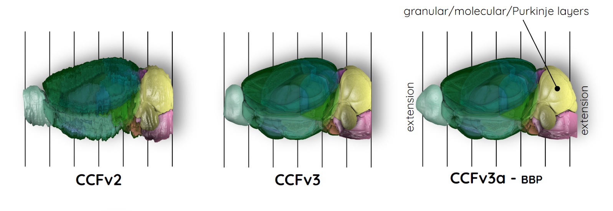

# An extended and improved CCF for the mouse brain has been added to BrainGlobe

[Piluso et al., 2025](https://doi.org/10.1162/imag_a_00565) recently published an extended and improved Common Coordinate Framework atlas version of the entire mouse brain, called CCFv3BBP or CCFv3a extended. While the previous [CCFv2 and CCFv3](https://doi.org/10.1016/j.cell.2020.04.007) atlas versions from the Allen Institute for Brain Science (AIBS) have been widely adopted by the neuroscience community, they retained certain limitations. The updated framework addresses these by incorporating the most rostral and caudal parts of the brain, resulting in a non-truncated main olfactory bulb, cerebellum, and medulla (CCFv3a), features absent or truncated in earlier versions. Additionally, the cerebellum annotation now includes the granular, molecular, and Purkinje cell layers. This new version also incorporates a high resolution (10 µm isotropic) Nissl-stained volume precisely aligned in the CCFv3a and also extended at the entire mouse brain level.

Building on this new data, a population-based average Nissl template was constructed from 86,901 coronal Nissl-stained slices, derived from 734 postnatal day 56 C57BL/6J mouse brains from the [AIBS in situ hybridization data portal](https://www.nature.com/articles/nature05453).

**Figure 1: Different versions of the Common Coordinate Framework: CCFv2 and CCFv3 from the AIBS, as well as the extended and improved CCFv3a-BBP from the Blue Brain Project.**

The CCFv3a is available in both 10 µm and 25 µm isotropic resolutions and can be accessed through BrainGlobe as `ccfv3augmented_mouse_10um` and `ccfv3augmented_mouse_25um`. The default anatomical template is the population average Nissl. If you wish to use the single animal volume which was used as our registration target it is accessible as an additional reference named `single_animal_nissl`. 

## How do I use the new atlas?

You can use the extended and improved CCF for visualisation like other BrainGlobe atlases. To visualise the atlas, you could follow the steps below:

* Install BrainGlobe ([instructions](/documentation/index))
* Open napari and follow the steps in our [download tutorial](/tutorials/manage-atlases-in-GUI.md) for the extended and improved CCF atlas.
* Visualise the different parts of the atlas as described in our [visualisation tutorial](/tutorials/visualise-atlas-napari)

## Why are we adding new atlases?

A fundamental aim of the BrainGlobe project is to make various brain atlases easily accessible by users across the globe. If you would like to get involved with a similar project, please [get in touch](/contact).
