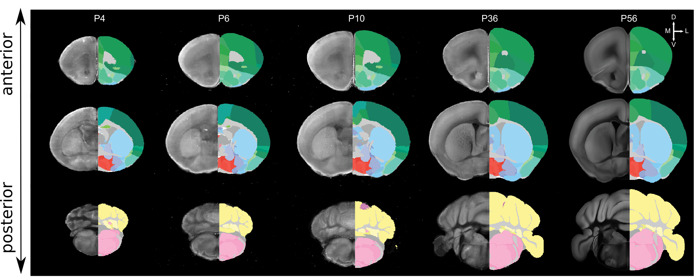

# DeMBA, A 4D atlas representing mouse brain development from adolescence to adulthood 

[Carey & Kleven et al., 2025](https://doi.org/10.1038/s41467-025-63177-9) recently published an atlas of postnatal mouse brain development called DeMBA (Developmental Mouse Brain Atlas). This atlas covers the mouse brain in development, from day 4 after birth through to adulthood at day 56 (three months).  DeMBA provides the Allen Mouse Brain CCF v3 brain region segmentations. One of the key features of DeMBA is that a researchers can choose day-specific templates corresponding to the developmental age they are studying. Another key feature is that DeMBA is integrated into the [BrainGlobe CCF Translator](https://github.com/brainglobe/brainglobe-ccf-translator), which allows data to be transformed to any age of the atlas (a total of 53 ages).



**Figure 1: Coronal sections of the DeMBA from anterior to posterior at five ages. Each section shows the STPT template on the left side and the transformed Allen Mouse Brain CCFv3 segmentations on the right side.**

DeMBA was created based on Serial Two-Photon Tomography (STPT) templates from five ages, with intermediate ages interpolated using CCF Translator. The STPT templates of the atlas are available at 20µm and 25µm resolution. Using the CCF Translator, Magnetic Resonance Imaging (MRI) and Light Sheet Fluorescence Microscopy (LSFM) templates from the adult were transformed into the spaces of all DeMBA ages. These are provided as alternative modalities at 20µm resolution. All ages of the atlas, from 4 to 56, are available through the BrainGlobeAPI. For instance, the 20 µm P4 atlas can be accessed through BrainGlobe as ```demba_allen_seg_dev_mouse_p4_20um```. For more information see the [atlas documentation](https://brainglobe.info/documentation/brainglobe-atlasapi/usage/atlas-details.html#demba-developmental-mouse-brain-atlas).

## How do I use the new atlas?

You can use the DeMBA for visualisation like other BrainGlobe atlases. To visualise the atlas, you could follow the steps below:

* Install BrainGlobe ([instructions](/documentation/index))
* Open napari and follow the steps in our [download tutorial](/tutorials/manage-atlases-in-GUI.md) for the extended and improved CCF atlas.
* Visualise the different parts of the atlas as described in our [visualisation tutorial](/tutorials/visualise-atlas-napari)

## Why are we adding new atlases?

A fundamental aim of the BrainGlobe project is to make various brain atlases easily accessible by users across the globe. If you would like to get involved with a similar project, please [get in touch](/contact).
