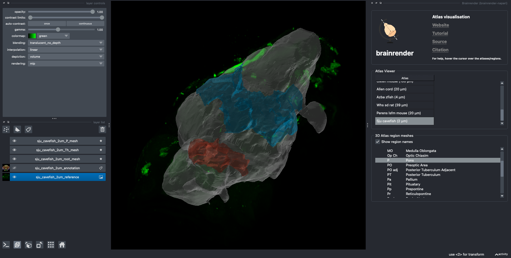

# An Atlas for the regenerative _Ambystoma mexicanum_ (axolotl) has been added to BrainGlobe

Amphibians have long captivated human's interest. An unusual amphibian amongst these is the Axolotl (_Ambystoma mexicanum_), notable for its regenerative capacities, which makes understanding its neuroanatomy even more fascinating. In 2021, [Lazcano et al.](https://www.nature.com/articles/s41598-021-89357-3), explored the axolotl's neuroanatomy via magnetic reasonance imaging (MRI) atlas of the juvenile axolotl brain. This brain atlas provides a comprehensive view of the whole brain's structure, and identified key brain region. Myelin-rich regions have also been localised in the posterior ends of the brain. The axolotl atlas enables us to gain better insights into the functionality underlying the central nervous system (CNS) regeneration.

**Figure 1. Lateral view of the axolotl brain atlas annotations.**

A collaboration between the Brainglobe Team and the data generated by the researchers in the study, made it now possible to make and view the axolotl atlas within the BrainGlove ecossystem. The atlas name is `unam_axolotl_40um`.

## How do I use the new atlas?

You can use the axolotl atlas like all other BrainGlobe atlases. If you're interested in what a axolotl brain looks like, you could follow the steps below

* Install BrainGlobe ([instructions](/documentation/index))
* Open napari and follow the steps in our [download tutorial](/tutorials/manage-atlas-in-GUI.md) for the axolotl atlas
* Visualise the different parts of the atlas as described in our [visualisation tutorial](/tutorials/visualise-atlas-napari)

The end result will look something like Figure 2.

**Figure 2: The cavefish atlas visualised with `brainrender-napari`: reference image in green, with mesh overlays for the brain (grey), the thalamus (red) and the pons (blue).**

## Why are we adding new atlases?

A fundamental aim of the BrainGlobe project is to enable the implementation of various brain atlases using similar software tools in a similar BrainGlobe framework easily accesible by users across the globe. We look forward to adding many more atlases of emerging model organisms to BrainGlobe in the future. In the meantime, if you would like to share your insights or get involved with similar project, please [get in touch](/contact).
