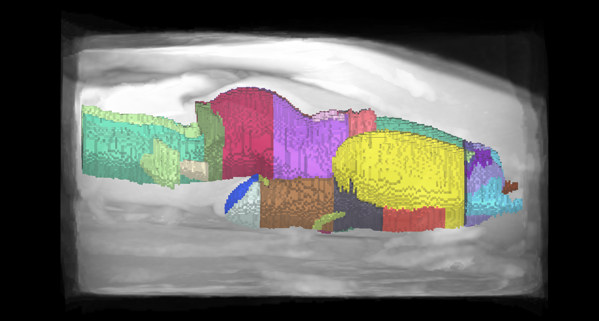
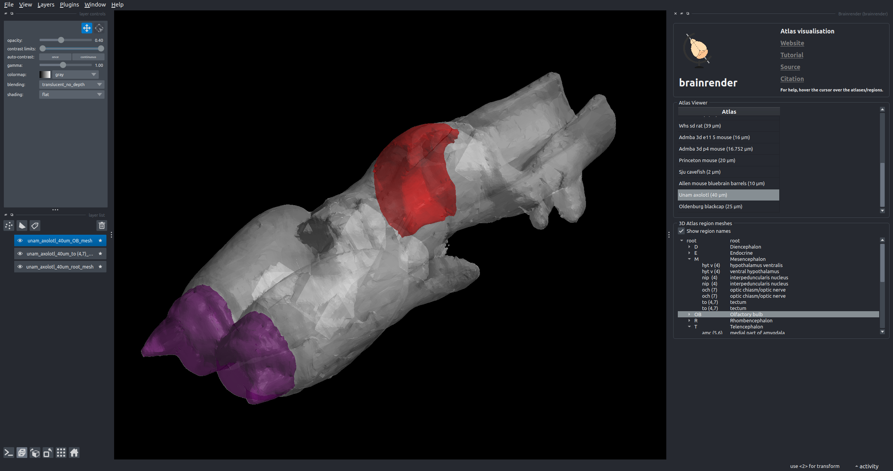

# An Atlas for the regenerative _Ambystoma mexicanum_ (axolotl) has been added to BrainGlobe

Amphibians have long captivated human's interest. An unusual amphibian amongst these is the Axolotl (_Ambystoma mexicanum_), which is sometimes used as a model organism for regeneration. In 2021, [Lazcano et al.](https://www.nature.com/articles/s41598-021-89357-3) created a magnetic resonance imaging (MRI) atlas of the juvenile axolotl brain. The axolotl atlas enables researchers to gain better insights into the processes underlying central nervous system (CNS) regeneration.

**Figure 1. Lateral view of the axolotl brain atlas annotations and reference image.**

The BrainGlobe team re-packaged the data generated and made public by the original study, making it now possible to use the axolotl atlas within the BrainGlobe ecosystem. The atlas name is `unam_axolotl_40um`.

Note that the reference image (as seen in Figure 1.) contains more than just the brain, so it may not be a good registration target for `brainreg`!

## How do I use the new atlas?

You can use the axolotl atlas for visualisation like other BrainGlobe atlases. If you're interested in what a axolotl brain looks like, you could follow the steps below

* Install BrainGlobe ([instructions](/documentation/index))
* Open napari and follow the steps in our [download tutorial](/tutorials/manage-atlases-in-GUI.md) for the axolotl atlas
* Visualise the different parts of the atlas as described in our [visualisation tutorial](/tutorials/visualise-atlas-napari)

The end result will look something like Figure 2.

**Figure 2: The axolotl atlas visualised with `brainrender-napari`: with mesh overlays for the brain (grey), the tectum (red, right hemisphere) and the olfactory bulb (blue).**

## Why are we adding new atlases?

A fundamental aim of the BrainGlobe project is to make various brain atlases easily accessible by users across the globe. The axolotl atlas is the first amphibian brain atlas available through BrainGlobe. If you would like to get involved with a similar project, please [get in touch](/contact).
