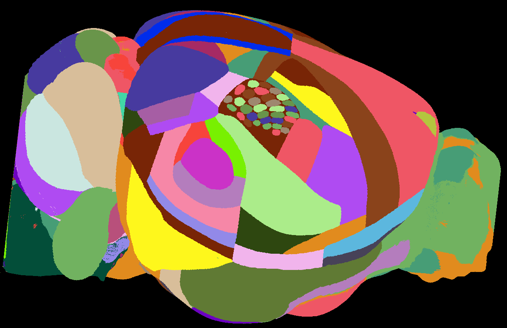

# A mouse brain atlas with barrel field annotations has been added to BrainGlobe

[Bolaños-Puchet et al., 2024](https://elifesciences.org/articles/80777) recently published annotations of the mouse
[barrel cortex](https://en.wikipedia.org/wiki/Barrel_cortex) in the 
[Allen Mouse Brain Common Coordinate Framework](https://doi.org/10.1016/j.cell.2020.04.007).
The Allen Mouse Brain Atlas (and particularly it's Common Coordinate Framework) has been key to advances in 
computational neuroanatomy in the adult mouse. However, this atlas does not contain any barrel cortex annotations.
These annotations allow researchers to much more precisely localise regions of interest within specific barrels, 
rather than barrel cortex as a whole. 

**Figure 1. Surface view of the barrel annotations.**

EPFL PhD student Axel Bisi and the BrainGlobe team have now worked together to make the atlas available within the BrainGlobe ecosystem. 
Two versions of the atlas are available, at 10μm (`allen_mouse_bluebrain_barrels_10um`) and 25μm resolution (`allen_mouse_bluebrain_barrels_25um`).

## How do I use the new atlas?

You can use the atlas like all other BrainGlobe atlases. To visualise the atlas in napari:
* Install BrainGlobe ([instructions](/documentation/index))
* Download the 25μm version of the atlas by running `brainglobe install -a allen_mouse_bluebrain_barrels_25um` in the terminal (make sure to activate your conda environment first)
* Run `napari -w brainrender-napari` and visualise the different parts of the atlas as described in our [visualisation tutorial](/tutorials/visualise-atlas-napari)

## Why are we adding new atlases?

A key goal of BrainGlobe is to ensure that computational neuroanatomy software doesn't need to be rewritten for new 
applications requiring novel atlases. We look forward to adding more atlases to BrainGlobe in the near future. 
If you'd like to get involved with a similar project, please [get in touch](/contact).
