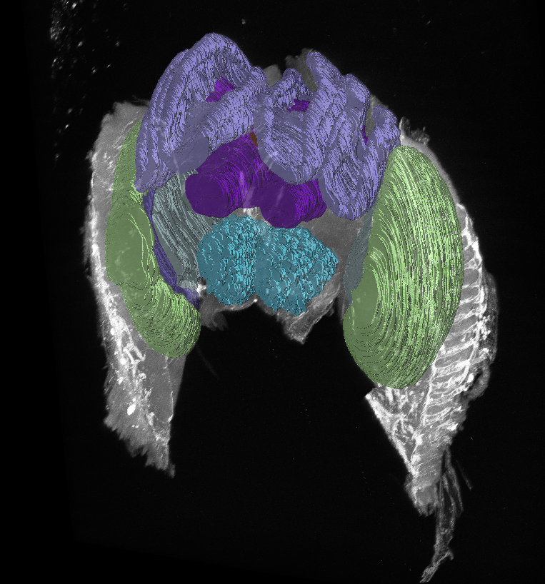

# An atlas of the bumblebee brain has been added to BrainGlobe

[Wang et al., 2025](https://doi.org/10.1016/j.cub.2022.04.066) recently published a brain atlas of the bumblebee _Bombus_ _impatiens_, which they used to investigate the the neuroanatomical basis of bees behaviour in different social situations. This is the first insect brain atlas to be added to BrainGlobe, and the second invertebrate brain atlas (following [the cuttlefish atlas](./cuttlefish-atlas-added.md)). Its template image was acquired with confocal microscopy, and is from one representative individual bee brain (Figure 1).

**Figure 1: A three-dimensional view of the Kocher lab's bumblebee brain atlas visualised with `brainrender-napari`.**

The bumblebee brain atlas has anisotropic resolution (pixel size is 2.542 µm in antero-posterior direction, and 1.2407 µm along other axes) and is named after senior author Sarah Kocher: it can be accessed through BrainGlobe as `kocher_bumblebee_2.542um`.

## How do I use the new atlas?

You can use the bumblebee atlas like other BrainGlobe atlases. To visualise the atlas, you could follow the steps below:

* Install BrainGlobe ([instructions](/documentation/index))
* Open napari and follow the steps in our [download tutorial](/tutorials/manage-atlases-in-GUI.md) for the bumblebee atlas
* Visualise the different parts of the atlas as described in our [visualisation tutorial](/tutorials/visualise-atlas-napari)

## Why are we adding new atlases?

A fundamental aim of the BrainGlobe project is to make various brain atlases easily accessible by users across the globe. If you would like to get involved with a similar project, please [get in touch](/contact).