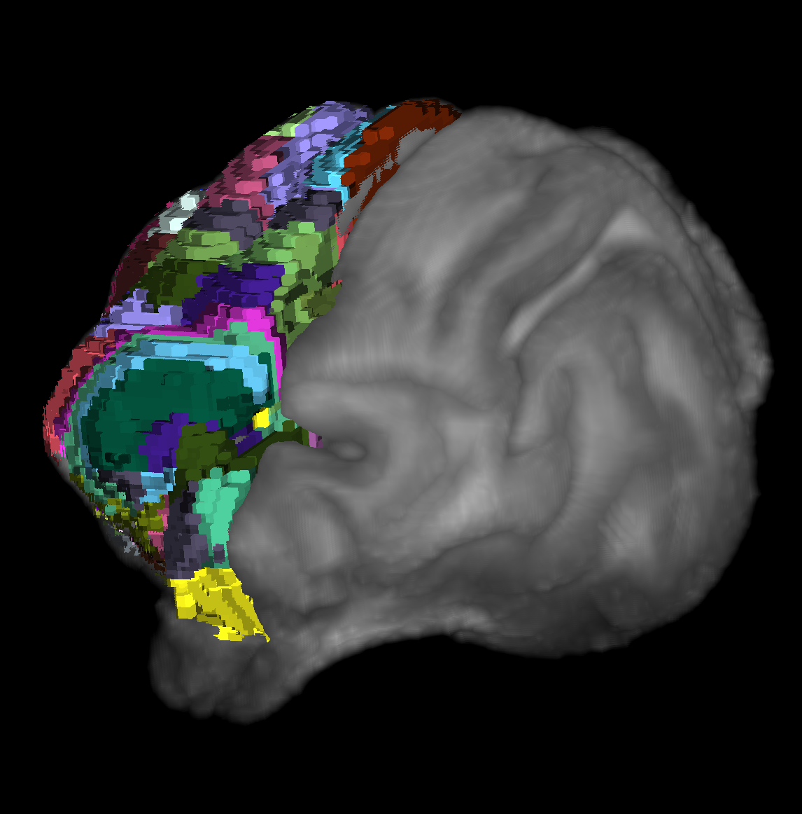

# An Atlas for the domestic cat has been added to BrainGlobe

[Stolzberg et al. (2017)](https://doi.org/10.1002/cne.24271) created an MRI atlas of the cat brain cortex at 500um resolution, nicknamed the "Catlas". Former UCL MSc student Henry Crosswell and the BrainGlobe team have now made this atlas available through BrainGlobe. We called it `csl_cat_500um`, after the Cerebral Systems Lab (CSL) that created this original data. Its main use is to standardise functional studies in cats - note that its annotations only cover the cortex.

**Figure 1. Three-dimensional view of the CSL cat brain MRI atlas using `brainrender-napari`, showing the cat's stereotypical gyri and sulci. The template image overlaid with just the right hemisphere of the annotations.**

## How do I use the new atlas?

You can use the cat brain atlas for visualisation like other BrainGlobe atlases. To visualise the atlas, you could follow the steps below:

* Install BrainGlobe ([instructions](/documentation/index))
* Open napari and follow the steps in our [download tutorial](/tutorials/manage-atlases-in-GUI.md) for the CSL cat atlas.
* Visualise the different parts of the atlas as described in our [visualisation tutorial](/tutorials/visualise-atlas-napari)

## Why are we adding new atlases?

A fundamental aim of the BrainGlobe project is to make various brain atlases easily accessible by users across the globe. The "Catlas" is the first carnivore atlas available in BrainGlobe. If you would like to get involved with a similar project, please [get in touch](/contact).
