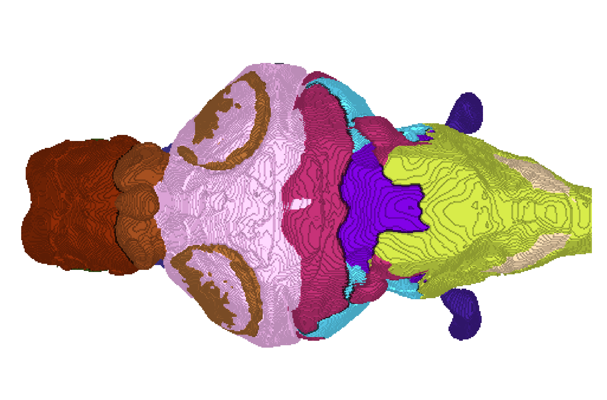

# An atlas for the Blind Mexican Cavefish has been added to BrainGlobe

[Kozol et al, 2023](https://elifesciences.org/articles/80777) recently published a brain atlas of the blind Mexican cavefish _Astyanax_ _mexicanus_. This species is interesting from an evolutionary point of view, due to divergent phenotypes (surface- and cave-dwelling) that can be hybridised in the lab. Surface-dwelling populations have retained their eyesight, while cave-dwellers have not. The cavefish brain atlas allows us to understand how brains of a single species have changed anatomically and functionally as part of their adaptations to the environment.

**Figure 1. Dorsal view of the cavefish brain atlas annotations.**

The BrainGlobe team and the lead author of the study, Robert Kozol, have now worked together to make the atlas available within the BrainGlobe ecosystem. The atlas name is `sju_cavefish_2um`.

## How do I use the new atlas?

You can use the cavefish atlas like all other BrainGlobe atlases. If you're interested in what a cavefish brain looks like, you could follow the steps below
* Install BrainGlobe ([instructions](/documentation/index))
* Download the cavefish atlas by running `brainglobe install -a sju_cavefish_2um` in the terminal (make sure to activate your conda environment first)
* Run `napari -w brainrender-napari` and visualise the different parts of the atlas as described in our [visualisation tutorial](/tutorials/visualise-atlas-napari)

The end result will look something like Figure 2.

**Figure 2: The cavefish atlas visualised with `brainrender-napari`: reference image in green, with mesh overlays for the brain (grey), the thalamus (red) and the pons (blue).**

## Why are we adding new atlases?

A key goal of BrainGlobe is to be species-agnostic, to avoid the need to re-implement similar software tools for different model organisms. We look forward to adding more atlases of emerging model organisms to BrainGlobe in the near future. If you'd like to get involved with a similar project, please [get in touch](/contact).
