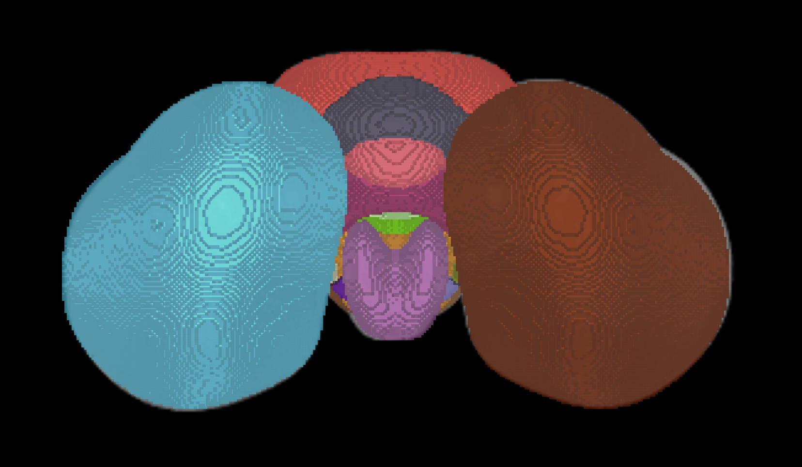
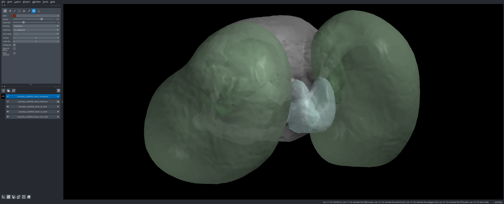

# Three Atlases for the Allen Common Coordinate Framework v2 Mouse Brain have been added to BrainGlobe

The mouse brain atlases provided by the Allen Institute for Brain Science (AIBS) are widely used in the neuroscience community, and as of the writing of this blog post, the most updated version of their atlas uses version 3 of the Common Coordinate Framework (CCF). However, there are many benefits from adding older versions of atlases, namely in terms of keeping a record of the history of atlas versions, as well as providing a way to translate between other older atlases that were based on CCFv2. Hence, we have packaged the three atlases provided by the Allen Institute, namely that of the mouse brain, its fiber tracts, and developmental origin. CCFv2 is [ADD SOMETHING ABOUT THE METHODOLOGY]

TOD

**Figure 1. Anterior view of the cuttlefish brain atlas annotations and reference image.**

The BrainGlobe team re-packaged the data generated and made public by the original study, making it now possible to use the cuttlefish atlas within the BrainGlobe ecosystem. The atlas name is `columbia_cuttlefish_50um`.

## How do I use the new atlas?

You can use the CCFv2 atlases for visualisation like other BrainGlobe atlases, as written below:

* Install BrainGlobe ([instructions](/documentation/index))
* Open napari and follow the steps in our [download tutorial](/tutorials/manage-atlases-in-GUI.md) for the CCFv2 atlas
* Visualise the different parts of the atlas as described in our [visualisation tutorial](/tutorials/visualise-atlas-napari)

The end result will look something like Figure 2.

Additionally, the CCFv2 mouse brain atlas can be used in conjunction with our CCF Translator to translate data between other mouse brain atlases based on the CCFv2 framwework. For more details, check out the [CCF Translator GitHub page](https://github.com/brainglobe/brainglobe-ccf-translator). 

**Figure 2: The cuttlefish atlas visualised with `brainrender-napari`: with mesh overlays for the brain (grey), the optic lobes (yellow, right hemisphere; green, left hemisphere) and the brachial lobe (blue).**

## Why are we adding new atlases?

A fundamental aim of the BrainGlobe project is to make various brain atlases easily accessible by users across the globe. The cuttlefish atlas is the first cephalopod brain atlas available through BrainGlobe. If you would like to get involved with a similar project, please [get in touch](/contact).
