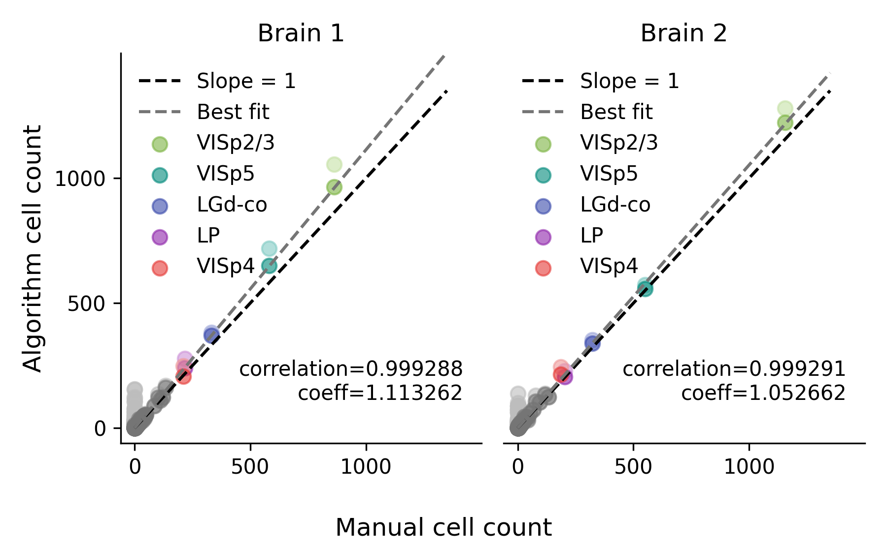
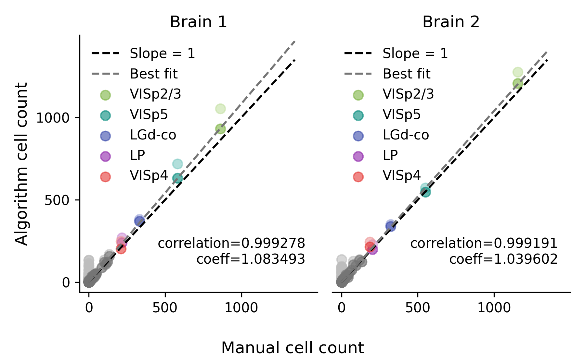

# Cellfinder version 1.3.0 is released!

We are excited to announce that a new version of `cellfinder` has been released. 

## Main updates
 * This update brings a significant change to the backend of `cellfinder`, as we have switched from TensorFlow to PyTorch. This change allows `cellfinder` to support python versions 3.11+, and simplifies the installation process. The new `cellfinder` version maintains the same classification accuracy. Models trained using previous versions of `cellfinder` will continue to work with the new version.


 * The default batch size used for detection has been increased to 64, which improves classification speed by approximately 40% on most systems. The batch size used for detection can now also be adjusted in the `napari` plugin.

## What do I need to do?

We recommend using a fresh conda environment to simplify the update.
For GPU support, please follow the installation instructions in the [documentation](../documentation/setting-up/gpu.md).

```bash
conda create -n cellfinder -c conda-forge python=3.11
conda activate cellfinder
pip install cellfinder
```

You can also update an existing installation of `cellfinder` using pip:

```bash
pip install --upgrade cellfinder
```


## Classification performance
The classification performance between the two versions is comparable. Below is a comparison of the performance between the two versions using data from the [`cellfinder` paper](https://doi.org/10.1371/journal.pcbi.1009074). Running `cellfinder` with a PyTorch backend results in a  comparable Pearson correlation and slightly improved linear best-fit slope (labelled as "coeff" in the plot) when comparing to manual cell counts. For more details on how the plots were generated, see the [`cellfinder` paper](https://doi.org/10.1371/journal.pcbi.1009074).

### TensorFlow backend

<p align="center">
    
</p>

### PyTorch backend

<p align="center">
    
</p>
