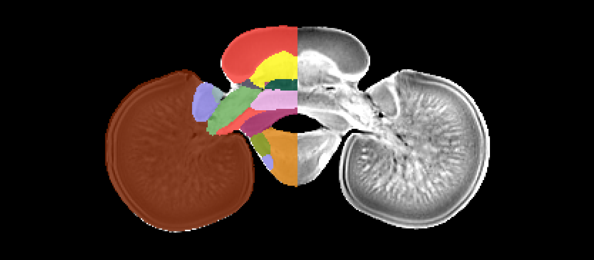

# An Atlas for the dwarf cuttlefish, _Sepia bandensis_ has been added to BrainGlobe

Cephalopods are fascinating model organisms for neuroscience research. The dwarf cuttlefish in particular (_Sepia bandensis_) is known for its camouflage using dynamic skin pattern changes, but it is also known to display social communication behaviour. In 2023, [Montague et al.](https://www.sciencedirect.com/science/article/pii/S0960982223007571) created a magnetic resonance imaging (MRI) atlas by combining data from 8 dwarf cuttlefish brains (4 female, 4 male) using deep learning. The cuttlefish atlas provides researchers with a useful resource for investigating the neural processes governing cephalopod behaviour. 

**Figure 1. Coronal section of the cuttlefish brain atlas annotations (only right hemisphere shown) and reference image.**

The BrainGlobe team re-packaged the data generated and made public by the original study, making it now possible to use the cuttlefish atlas within the BrainGlobe ecosystem. The atlas name is `columbia_cuttlefish_50um`, after the institution of its original authors.

## How do I use the new atlas?

You can use the cuttlefish atlas for visualisation like other BrainGlobe atlases. If you're interested in what a cuttlefish brain looks like, you could follow the steps below

* Install BrainGlobe ([instructions](/documentation/index))
* Open napari and follow the steps in our [download tutorial](/tutorials/manage-atlases-in-GUI.md) for the cuttlefish atlas
* Visualise the different parts of the atlas as described in our [visualisation tutorial](/tutorials/visualise-atlas-napari)

The end result will look something like Figure 2.

**Figure 2: The cuttlefish atlas visualised with `brainrender-napari`: with mesh overlays for the brain (grey), the optic lobes (green, left hemisphere) and the brachial lobe (light blue).**

## Why are we adding new atlases?

A fundamental aim of the BrainGlobe project is to make various brain atlases easily accessible by users across the globe. The cuttlefish atlas is the first cephalopod brain atlas available through BrainGlobe. If you would like to get involved with a similar project, please [get in touch](/contact).
