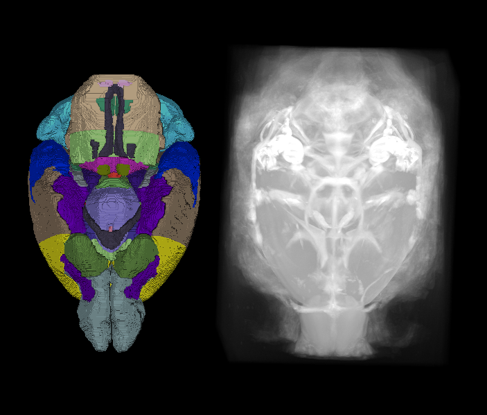
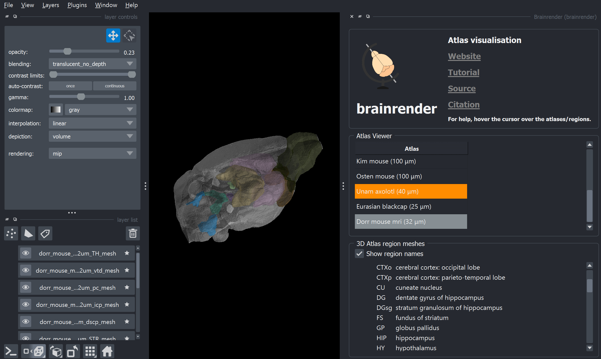

# A new mouse MRI atlas been added to BrainGlobe
[Dorr et al. (2008)](https://doi.org/10.1016/j.neuroimage.2008.03.037) created a high-resolution, three-dimensional MRI-based atlas of the adult C57Bl/6J mouse brain, providing  comprehensive anatomical coverage of the cerebrum, cerebellum, and brainstem. 

The atlas was constructed from within-skull, T2-weighted MR images acquired at 32 μm isotropic resolution from forty 12-week-old mice scanned at 7T. Following normalisation, registration, and averaging of individual scans, 62 distinct brain structures were manually delineated.

This atlas is now available through BrainGlobe. We called it `dorr_mouse_mri_32um` and its annotations are closely aligned to the Allen Mouse Brain Atlas.

**Figure 1. Three-dimensional view of the Dorr mouse MRI brain atlas: annotations (left) and reference (right).**

## How do I use the new atlas?
You can use the Dorr mouse MRI atlas like all other BrainGlobe atlases. To visualise the atlas, you could follow the steps below:
* Install BrainGlobe ([instructions](/documentation/index)).
* Open Napari and follow the steps in our [download tutorial](/tutorials/manage-atlases-in-GUI.md) for the `dorr_mouse_mri_32um` atlas.
* Run `napari -w brainrender-napari` and visualise the different parts of the atlas as described in our [visualisation tutorial](/tutorials/visualise-atlas-napari).

The end result will look something like Figure 2.

**Figure 2: The Dorr mouse MRI atlas visualised with `brainrender-napari`.**

## Why are we adding new atlases?
A fundamental aim of the BrainGlobe project is to make various brain atlases easily accessible by users across the globe. If you would like to get involved with a similar project, please [get in touch](/contact).
