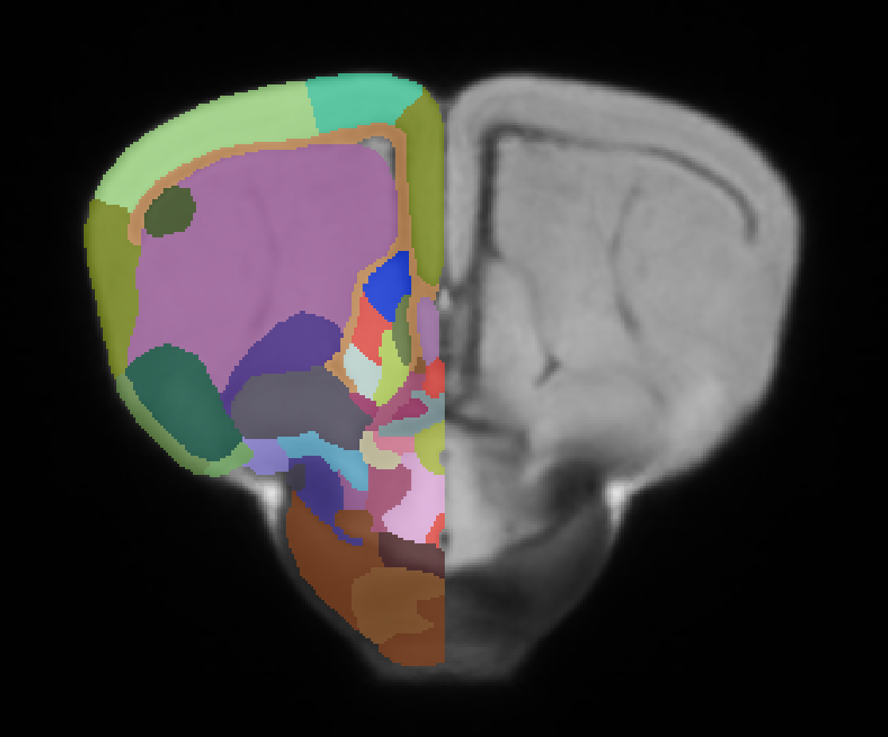
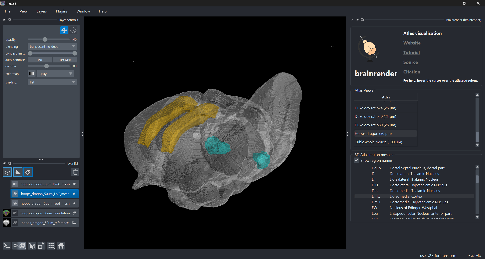

# A Brain Atlas for the Tawny Dragon, _Ctenophorus decresii_, has been added to BrainGlobe

The tawny dragon is an Australian lizard which has shown great promise for neuroevolutionary research, as investigating the variation among reptile species allows for a greater exploration of the processes that govern vertebrate brain development. As this is an emerging model species there was a need for a standardised tawny dragon brain atlas. To this end, [Hoops et al.](https://doi.org/10.1007/s00429-021-02282-z) used structural MRI to obtain the average 3D brain from 13 male tawny dragons and segmented 224 structures. This atlas is now available through the BrainGlobe atlas API, and is the first lizard brain to be added to BrainGlobe. 

- **Atlas name:** `hoops_dragon_50um`
- **Resolution:** 50 µm isotropic
- **Modality:** MRI

**Figure 1: Coronal section of the tawny dragon brain atlas annotations (only right hemisphere shown) and reference image.**

## How do I use the new atlases?

You can use the tawny dragon brain atlas for visualisation like other BrainGlobe atlases, as written below:

* Install BrainGlobe ([instructions](/documentation/index))
* Open napari and follow the steps in our [download tutorial](/tutorials/manage-atlases-in-GUI.md) for `hoops_dragon_50um`
* Visualise the different parts of the atlas as described in our [visualisation tutorial](/tutorials/visualise-atlas-napari)

The end result will look something like Figure 2.

**Figure 2: The Tawny Dragon Brain atlas visualised with `brainrender-napari`: with mesh overlays for the brain (grey), the locus coeruleus (cyan) and the dorsomedial cortex (yellow).**

## Why are we adding new atlases?

A fundamental aim of the BrainGlobe project is to make various brain atlases easily accessible by users across the globe. The tawny dragon brain atlas allows for users to use the atlases created by Hoops et al easily on BrainGlobe. If you would like to get involved with a similar project, please [get in touch](/contact).
