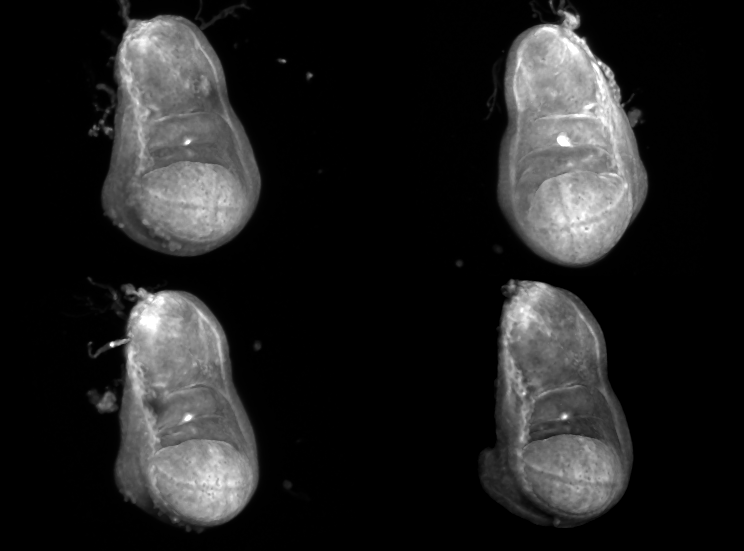
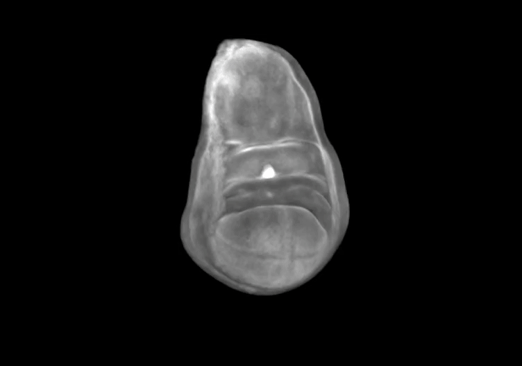

# A three-dimensional digital atlas for the imaginal wing disc of the fruit fly _Drosophila_ _melanogaster_

Building on the team's experience making [neuroanatomical atlases from scratch](https://brainglobe.info/blog/uncharted-brains.html), BrainGlobe core developer Alessandro Felder teamed up with [Dr Giulia Paci](https://giuliapaci.github.io/research/) from the [UCL Tissue Mechanics Lab](https://www.tissuemechanicslab.com), to explore the use of atlases (in the neuroanatomical sense) outside of neuroscience. Giulia is an expert in developmental mechanobiology of the fly. She uses the imaginal wing disc, a part of the fly larva that will later develop into the adult wing and notum, as a model organism for her research on how organisms develop robustly in noisy environments.

**Figure 1. Example confocal images of the imaginal wing disc that were used to build the atlas, showcasing the variability between samples**

Our collaboration took the form of co-supervising an MRes student, Kaixiang Shuai, whose aim it was to build an anatomical atlas of the fruit fly wing disc, at the 3rd instar developmental stage. Kaixiang learnt the required interdisciplinary skills - fly-handling, microscopy, Python and Github - very quickly. He proceeded to successfully dissect 16 wing discs, and image them with a confocal microscope. Then, he implemented a preprocessing pipeline that filtered these images, and set them up in a way that they could be run through [BrainGlobe's template builder pipelines](https://github.com/brainglobe/brainglobe-template-builder). Finally, he annotated the resulting template and packaged the new atlas for BrainGlobe - this final, important step means it is now possible for developmental _Drosophila_ researchers to use BrainGlobe to benefit from the advantages of the common coordinate space that an atlas provides.

**Figure 2. An animation of the wing disc atlas, showing the template image and progressively appearing meshes for the pouch (red), the hinge (green) and the notum (blue).**

## How do I use the new atlas?

You can use the wing disc atlas like other BrainGlobe atlases. Its name is `drosophila_wingdisc_instar3_2um`. To visualise it, you can:

* Install BrainGlobe ([instructions](/documentation/index))
* Open napari and follow the steps in our [download tutorial](/tutorials/manage-atlases-in-GUI.md) for this atlas
* Visualise the different parts of the atlas as described in our [visualisation tutorial](/tutorials/visualise-atlas-napari)

## Future plans

As far as we are aware, this is the first population-based anatomical atlas for use in fundamental biological research beyond neuroscience. We believe that atlas-based image analysis could be very useful for the developmental biology community, in particular by providing an unbiased anatomical coordinate space where multimodal data from different samples (and studies!) can be integrated. We therefore plan to continue this exploratory work. Many things can still be improved, including
* Gaining a deeper understanding of applications where the wing disc atlas might be particularly useful
* Making templates for other developmental stages
* Improvements to the template resolution
* Refining the annotations, e.g. by registering genetically marked regions of significance into the atlas space.

If you would like to know more, or get involved with a similar project, please [get in touch](/contact).
