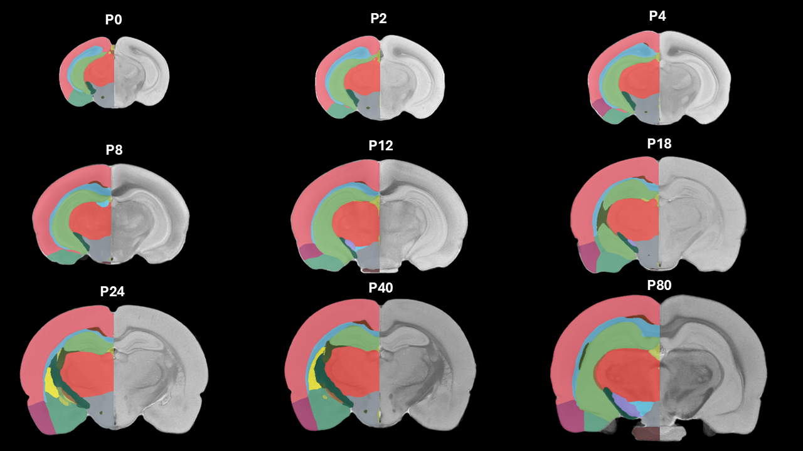
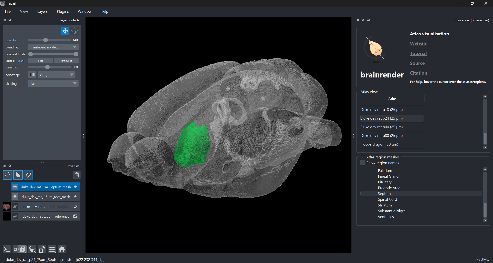

# The Duke Developmental Rat Brain Atlases have been added to BrainGlobe

The brain continues to develop well after an organism is born. To provide a comprehensive view of the growth of various brain regions in rats, [Calabrese et al. (2013)](https://doi.org/10.1016/j.neuroimage.2013.01.017) of Duke University created a high resolution averaged T2 MRI atlas of postnatal rat brain development using five specimens each at nine different timepoints (P0, P2, P4, P8, P12, P18, P24, P40, P80). The authors annotated the nine time points with the same 26 developmentally distinct regions, allowing them to plot growth curves for the rat brain by measuring their volumes over time. We have packaged the nine atlases which comprise the Duke Developmental Rat Brain Atlas to be used within BrainGlobe. 

**Figure 1. The nine timepoints of the Duke Developmental Rat Brain Atlas, with right annotations overlaid on references (not to scale).**

The BrainGlobe team re-packaged the data generated and made public by the authors, making it now possible to use the Duke Developmental Rat Brain Atlas within the BrainGlobe ecosystem. The atlas names are:

* `duke_dev_rat_p00_25um`
* `duke_dev_rat_p02_25um`
* `duke_dev_rat_p04_25um`
* `duke_dev_rat_p08_25um`
* `duke_dev_rat_p12_25um`
* `duke_dev_rat_p18_25um`
* `duke_dev_rat_p24_25um`
* `duke_dev_rat_p40_25um`
* `duke_dev_rat_p80_25um`

## How do I use the new atlases?

You can use the Duke Developmental Rat Brain Atlas for visualisation like other BrainGlobe atlases. You can either open it in Neuroglancer for viewing in the browser [here](https://neuroglancer-demo.appspot.com/#!https://brainglobe.s3.amazonaws.com/ng_state_files/duke_dev_rat_p00.json) or you can view it locally as written below:

* Install BrainGlobe ([instructions](/documentation/index))
* Open napari and follow the steps in our [download tutorial](/tutorials/manage-atlases-in-GUI.md) for the Duke Developmental Rat Brain Atlases
* Visualise the different parts of the atlas as described in our [visualisation tutorial](/tutorials/visualise-atlas-napari)

The end result will look something like Figure 2.

**Figure 2: The Duke Developmental P24 Rat Brain Atlas visualised with `brainrender-napari`: with mesh overlays for the brain (grey) and the septum (green).**

## Why are we adding new atlases?

A fundamental aim of the BrainGlobe project is to make various brain atlases easily accessible by users across the globe. These atlases allow for BrainGlobe users to easily access a developmental rat brain atlas. If you would like to get involved with a similar project, please [get in touch](/contact).
