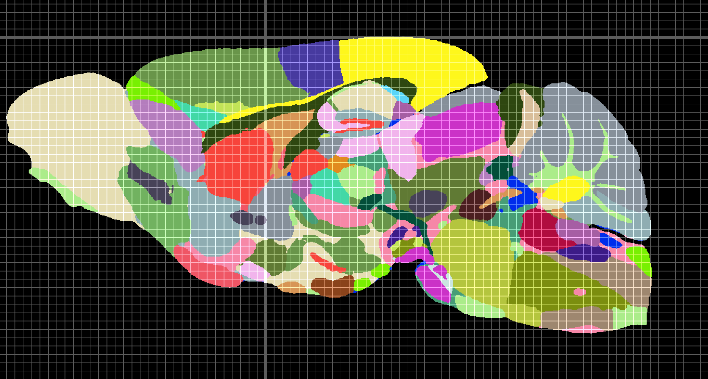

# Duke Mouse Brain Atlas has been added to BrainGlobe

[Mansour et al. (2025)](https://doi.org/10.1126/sciadv.adq8089) introduced the Duke Mouse Brain Atlas (DMBA), a high-resolution 15 µm isotropic stereotaxic atlas of the adult mouse brain. The atlas combines magnetic resonance histology (MRH), diffusion MRI-derived contrasts, micro-CT, light sheet microscopy, and registered anatomical annotations in a common reference space.

The atlas is now available through BrainGlobe as `duke_mouse_15um`.

One useful feature of the DMBA is how it was built. The MRH data were acquired from perfusion-fixed specimens with the brains still in the skull. This makes the reference less affected by global or regional swelling, shrinkage, and deformation than atlases built after cranial dissection or conventional histological sectioning.

For BrainGlobe, the main reference image is the DMBA mean diffusivity template, and the annotation image uses the RCCFv3 labels supplied with the atlas data. RCCFv3 is the Duke team's reduced version of the Allen CCFv3 label set: related structures smaller than 0.1 mm<sup>3</sup> were grouped into larger anatomical regions, reducing registration noise from small regions that are difficult to align reliably.

The BrainGlobe package includes 12 registered reference images. In addition to the main mean diffusivity template, the package includes AD, DWI, NQA, RD, FA, M0, M1, M2, M3, ISO, and unmasked mGRE. These complementary images can be useful for different anatomical questions because each contrast highlights different tissue properties.


**Figure 1. The 12 registered reference images included in the `duke_mouse_15um` atlas package.**

Another practical feature is the stereotaxic grid information. In the source atlas, micro-CT scans of the skull were registered to the MRH reference, giving bregma and lambda landmarks in the same coordinate space as the brain. BrainGlobe includes combined grid templates at 0.2 mm and 1 mm spacing that show the location of bregma, which can help with stereotaxic targeting and electrophysiology trajectory planning.



**Figure 2. Sagittal view of the Duke Mouse Brain Atlas with the 0.2 mm stereotaxic grid overlaid. Bregma is indicated by the crossing of the thicker grid lines.**

## Source and citation

The source data are available from [Duke CIVMImageSpace](https://civmimagespace.civm.duhs.duke.edu/tp_item_detail.php/view/item_number=DMBA/set_id=315).

Please cite the original atlas publication when using these data:

Mansour H, Azrak R, Cook JJ, Hornburg KJ, Qi Y, Tian Y, Williams RW, Yeh F-C, White LE, Johnson GA. The Duke Mouse Brain Atlas: MRI and light sheet microscopy stereotaxic atlas of the mouse brain. _Science Advances_ 2025. [https://doi.org/10.1126/sciadv.adq8089](https://doi.org/10.1126/sciadv.adq8089)

## How do I use the new atlas?

You can use the Duke Mouse Brain Atlas like all other BrainGlobe atlases. To visualise the atlas, you could follow the steps below:

* Install BrainGlobe ([instructions](/documentation/index)).
* Open napari and follow the steps in our [download tutorial](/tutorials/manage-atlases-in-GUI.md) for the `duke_mouse_15um` atlas.
* Run `napari -w brainrender-napari` and visualise the different parts of the atlas as described in our [visualisation tutorial](/tutorials/visualise-atlas-napari).

You can also load the atlas programmatically with BrainGlobe Atlas API:

```python
from brainglobe_atlasapi import BrainGlobeAtlas

atlas = BrainGlobeAtlas("duke_mouse_15um")
```

## Why are we adding new atlases?

A fundamental aim of the BrainGlobe project is to make various brain atlases easily accessible by users across the globe. If you would like to get involved with a similar project, please [get in touch](/contact).
