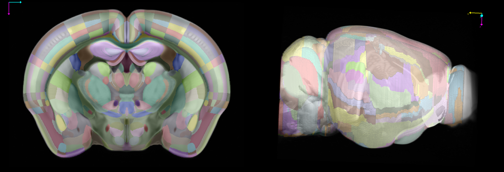

# Enhanced and Unified Mouse Brain Atlas v2 has been added to BrainGlobe

[Chon et al. (2019)](https://doi.org/10.1038/s41467-019-13057-w) introduced a unified and more finely segmented anatomical labeling 
for the adult mouse brain based on the Allen Common Coordinate Framework (CCF). 
This atlas integrates the widely used Franklin-Paxinos (FP) labels into the Allen CCF space, providing consistent and detailed segmentation, 
including refinements in the dorsal striatum using cortico-striatal connectivity data.

**Figure 1. Coronal and lateral views of the mouse brain, visualized using the napari viewer**

The latest update (Version 2, 2024) addresses inconsistencies in the original anatomical labels and ontology file and provides 20 µm isotropic labels generated through shape interpolation.

The atlas is now also available through BrainGlobe under the name `kim_mouse_isotropic_20um`.

## How do I use the new atlases?
You can use these atlases for visualisation and analysis, like other BrainGlobe atlases. To visualise an atlas, follow the steps below:
* Install BrainGlobe ([instructions](/documentation/index))
* Open napari and follow the steps in our [download tutorial](/tutorials/manage-atlases-in-GUI.md) for your atlas of choice
* Visualise the different parts of the atlas as described in our [visualisation tutorial](/tutorials/visualise-atlas-napari)

To use the atlas with other software such as [brainreg](/documentation/brainreg/index), please follow the instructions for those tools, and simply choose this atlas from the user interface. And remember to cite the original publication as well as any BrainGlobe tools you used!

## Why are we adding new atlases?
A fundamental aim of the BrainGlobe project is to make various brain atlases easily accessible by users across the globe. If you would like to get involved with a similar project, please [get in touch](/contact).
