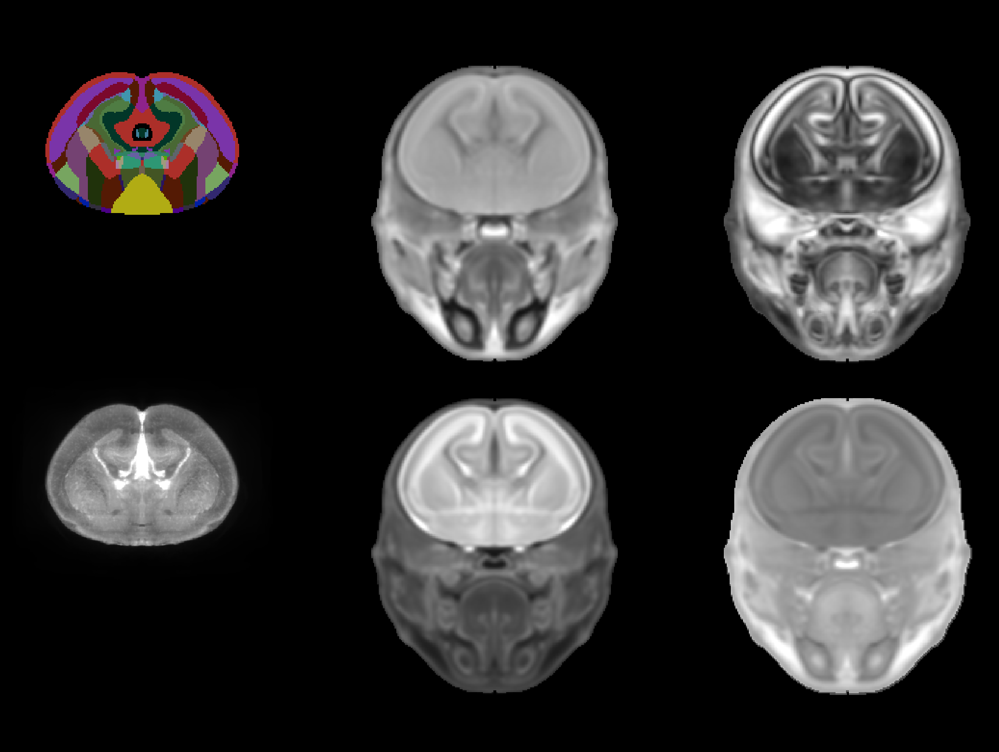
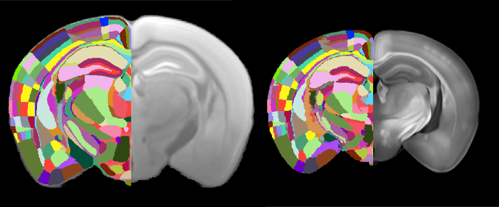

# An overview of recently added mouse atlases

Eagle-eyed BrainGlobe enthusiasts will have spotted several new atlases appearing in the BrainGlobe Atlas API in recent weeks. In 2025, we've made three new mouse brain atlases newly available through BrainGlobe: The Kim developmental mouse brain atlas (version 1), the Gubra multimodal mouse brain atlas and the Australian mouse brain atlas. Mice are widely used in neuroscience, so it's no surprise there are many mouse brain atlases. In this blogpost, we describe the newly added atlases in more detail, and suggest potential use cases. This blog covers the new murine atlases only - we have also added the [first non-human primate brain atlas to BrainGlobe](/blog/mouse-lemur-added) (and brain atlases for a cat and a cuttlefish are underway)!

## Kim developmental mouse brain atlas v1 (Kim DevCCF)
The [Kim developmental mouse brain atlas](https://doi.org/10.1038/s41467-024-53254-w) is a multimodal atlas available at 4 embryonic and 3 postnatal timepoints. At each timepoint, the atlas combines a 20um resolution LSFM template with a number of different MRI templates with varying resolution. We illustrate these here by showing the embryonic subset of the LSFM templates (Figure 1.) and all templates for the single E18.5 stage (Figure 2.), but you can find all the available templates in [the detailed documentation](/documentation/brainglobe-atlasapi/usage/atlas-details).

**Figure 1. LSFM templates for embryonic developmental stages (from left to right: E11.5, E13.5, E15.5, E18.5) available in the Kim DevCCF.**

**Figure 2. Annotations (top left), LSFM template (bottom left) and various MRI templates (T2, FA, ADC, DWI - clockwise from top centre) for KimDevCCF embryonic stage E18.5.**

This is an update to an earlier version of the same lab (v001 - only at P56, and notably in a different coordinate space!). It is an improvement compared to the Allen Developing Mouse Brain atlas (ADMBA), the other developmental mouse brain atlas available through BrainGlobe, because it represents an average of several individuals and is based on fully three-dimensional imaging methods rather than a series of histological sections.

## Gubra's Multimodal 3D mouse brain atlas

**Figure 3. A visualisation of both the MRI (left) and LSFM (right) templates and their (right-hemisphere) annotations contained in Gubra's multimodal mouse brain atlas. Note that both modes are available at 25um, but the LSFM is slightly smaller due to shrinkage effects of sample preparation for LSFM.**

[Perens et al.](https://doi.org/10.1007/s12021-023-09623-9) created a multimodal atlas of the mouse brain containing both an MRI and an LSFM template at 25 micrometer resolution (`perens_stereotaxic_mri_mouse_25um` and `perens_multimodal_lsfm_25um`, respectively), with annotations based on the Allen Mouse Brain atlas. 

## Australian mouse brain atlas

**Figure 4. A coronal section of the Australian mouse brain, showing annotations in the right hemisphere.**

At 15um pixel size, the [Australian mouse brain atlas](https://imaging.org.au/AMBMC/) (Figure 4.) is the highest-resolution MRI-based mouse brain atlas currently available, and comes with annotations based on a widely used histological atlas, the Paxinos and Franklin mouse brain in stereotaxic coordinates[^Paxinos]. It may therefore be most useful in cases where one would like to compare regions from histology to corresponding MRI data in fine detail, and is available in BrainGlobe as `australian_mouse_15um`.

[^Paxinos]: Paxinos and Franklin, The Mouse Brain in Stereotaxic Coordinates, [ISBN 0123694604](https://books.google.co.uk/books/about/The_Mouse_Brain_in_Stereotaxic_Coordinat.html)

## How do I use the new atlases?
You can use these atlases for visualisation and analysis, like other BrainGlobe atlases. To visualise an atlas, follow the steps below:
* Install BrainGlobe ([instructions](/documentation/index))
* Open napari and follow the steps in our [download tutorial](/tutorials/manage-atlases-in-GUI.md) for your atlas of choice
* Visualise the different parts of the atlas as described in our [visualisation tutorial](/tutorials/visualise-atlas-napari)

To use the atlas with other software such as [brainreg](/documentation/brainreg/index), please follow the instructions for those tools, and simply choose this atlas from the user interface. Note that some MRI atlases might not be good registration targets, because they include tissue outside the brain. And remember to cite the original publication as well as any BrainGlobe tools you used!

## Why are we adding new atlases?
A fundamental aim of the BrainGlobe project is to make various brain atlases easily accessible by users across the globe. If you would like to get involved with a similar project, please [get in touch](/contact).
