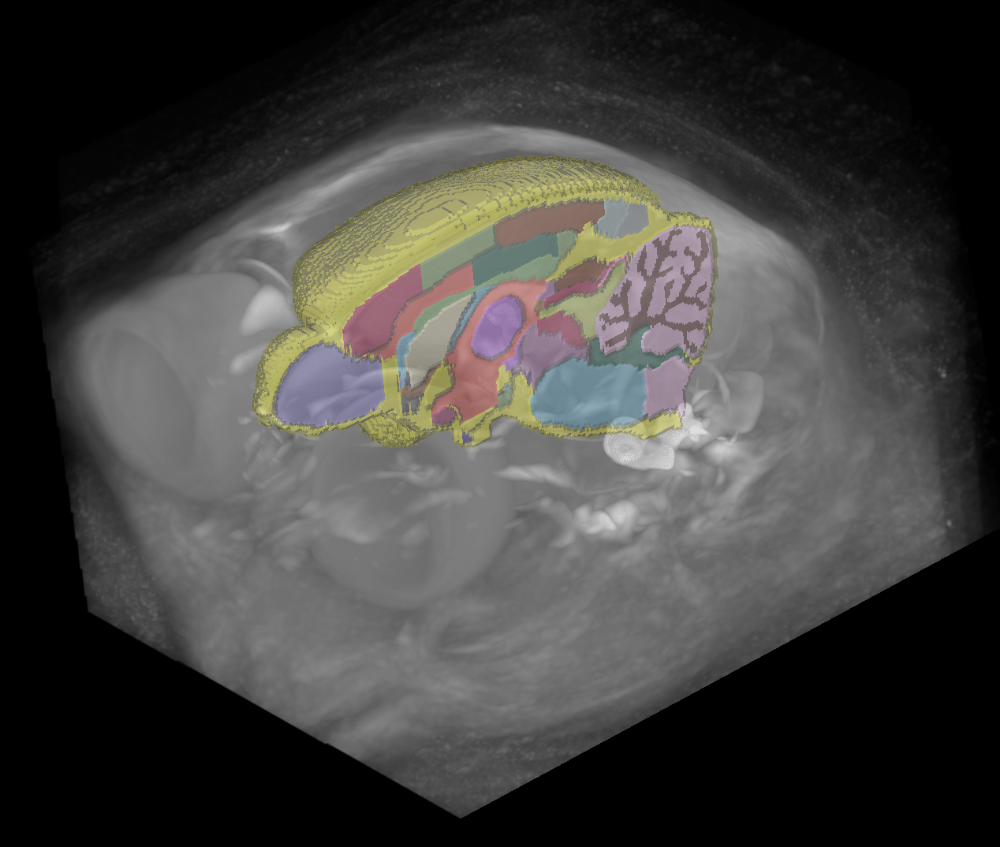

# An Atlas for the non-human primate _Microcebus murinus_ (grey mouse lemur) has been added to BrainGlobe

Thanks to its small size and its close phylogenetic relation to humans (compared to other model organisms), the grey mouse lemur is a practical choice to study brain evolution and disease. [Nadkarni et al.](https://doi.org/10.1016/j.dib.2018.10.067) made the first publicly available mouse lemur atlas in 2018. They imaged mouse lemur brains with MRI at 91μm resolution.  Thanks to [Harry Carey (University of Oslo)](https://github.com/PolarBean) it is now accessible from BrainGlobe. In reference to its original authors, the atlas is named `nadkarni_mri_mouselemur_91um` in the BrainGlobe ecosystem.

**Figure 1. Three-dimensional view of the Nadkarni mouse lemur MRI atlas using `brainrender-napari`, with the template image overlaid with just the right hemisphere of the annotations.**

Note that the reference image (as seen in Figure 1.) contains more than just the brain, so it may not be a good registration target for `brainreg`!

## How do I use the new atlas?

You can use the mouse lemur atlas for visualisation like other BrainGlobe atlases. To visualise the atlas, you could follow the steps below:

* Install BrainGlobe ([instructions](/documentation/index))
* Open napari and follow the steps in our [download tutorial](/tutorials/manage-atlases-in-GUI.md) for the mouse lemur atlas
* Visualise the different parts of the atlas as described in our [visualisation tutorial](/tutorials/visualise-atlas-napari)

## Why are we adding new atlases?

A fundamental aim of the BrainGlobe project is to make various brain atlases easily accessible by users across the globe. The mouse lemur atlas is the first non-human primate brain atlas available through BrainGlobe. If you would like to get involved with a similar project, please [get in touch](/contact).
