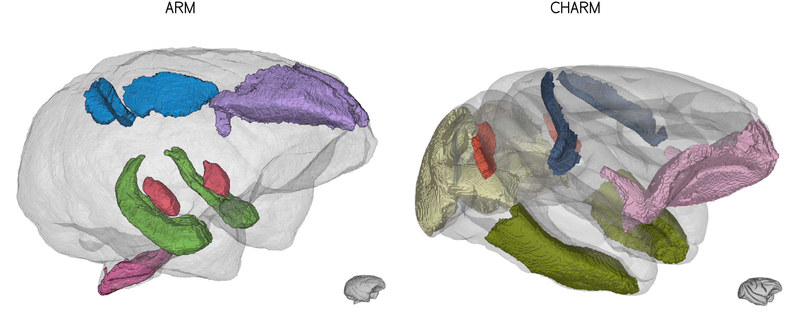

# NMT macaque brain atlases added to BrainGlobe

Three rhesus macaque (_Macaca mulatta_) atlases from the NIMH Macaque Template (NMT) ecosystem are now available through BrainGlobe. These are the first macaque monkey atlases to be added to BrainGlobe, expanding the available non-human primate resources to a widely used model species for systems, cognitive, and translational neuroscience.

The new atlases are all symmetric, full-head, 250 um isotropic atlases in NMT space. The [NMT v2](https://afni.nimh.nih.gov/pub/dist/doc/htmldoc/nonhuman/macaque_tempatl/template_nmtv2.html) is a high-resolution population-average macaque template introduced by [Jung et al. (2021)](https://doi.org/10.1016/j.neuroimage.2021.117997). It provides symmetric and asymmetric variants, multiple fields of view and resolutions, a manually refined brain mask, tissue segmentations, surfaces, and companion atlases for cortical and subcortical analyses. The full-head version keeps a larger field of view that includes non-brain tissue, which can be useful for alignment workflows.

The three new BrainGlobe atlases make the cortical, subcortical, and combined NMT macaque resources available through the same interface as other BrainGlobe atlases.



**Figure 1. NMT macaque atlas annotations visualised in `brainrender`, showing the combined ARM hierarchy alongside cortical CHARM regions.**

## Cortical Hierarchy Atlas of the Rhesus Macaque (CHARM)

The [CHARM](https://afni.nimh.nih.gov/pub/dist/doc/htmldoc/nonhuman/macaque_tempatl/atlas_charm.html) is a hierarchical cortical atlas described by Jung et al. (2021). It parcellates the macaque cortex across six spatial scales, from broad cortical lobes to finer D99-derived cortical regions.

- **Atlas name:** `nmt_charm_sym_macaque_250um`
- **Resolution:** 250 um isotropic
- **Template space:** Symmetric full-head NMT v2.0
- **Coverage:** Cortex
- **Species:** _Macaca mulatta_
- **Annotations:** Six-level cortical hierarchy, allowing users to choose a coarse or fine parcellation scale depending on the analysis.

This atlas is useful for studies focused on cortical regions, especially where a hierarchical cortical parcellation is useful for comparing analyses at different anatomical scales.

## Subcortical Atlas of the Rhesus Macaque (SARM)

The [SARM](https://afni.nimh.nih.gov/pub/dist/doc/htmldoc/nonhuman/macaque_tempatl/atlas_sarm.html) is a hierarchical subcortical atlas described by [Hartig et al. (2021)](https://doi.org/10.1016/j.neuroimage.2021.117996). It was built from high-resolution ex vivo structural imaging and histological data, then warped and refined in NMT v2 space.

- **Atlas name:** `nmt_sarm_sym_macaque_250um`
- **Resolution:** 250 um isotropic
- **Template space:** Symmetric full-head NMT v2.0
- **Coverage:** Subcortex
- **Species:** _Macaca mulatta_
- **Annotations:** Six-level subcortical hierarchy, based on fine regions of interest and broader composite regions suitable for MRI and fMRI analyses.

This atlas complements CHARM by covering subcortical structures, including the basal ganglia, thalamus, hypothalamus, brainstem, cerebellum, and other non-cortical regions.

## Atlas of the Rhesus Macaque (ARM)

The ARM combines the cortical CHARM and subcortical SARM resources into a single full-brain hierarchy in the updated NMT v2.1 symmetric full-head space. In BrainGlobe, it provides one atlas for users who want cortex and subcortex together rather than loading separate cortical and subcortical atlases.

- **Atlas name:** `nmt_arm_sym_macaque_250um`
- **Resolution:** 250 um isotropic
- **Template space:** Symmetric full-head NMT v2.1
- **Coverage:** Whole brain, with cortical and subcortical branches
- **Species:** _Macaca mulatta_
- **Annotations:** Combined CHARM and SARM hierarchy, with a top-level split between cortex and subcortex.

ARM is more than a simple combination of CHARM and SARM. In the subcortex, the hippocampal annotation is improved and finer than in the NMT v2.0 distribution, including more detailed hippocampal formation subdivisions such as anterior and posterior hippocampal, dentate gyrus, and CA1-3 regions.

## Future plans

We are planning to add more non-human primate atlases to BrainGlobe, including asymmetric versions of these macaque resources where source data are available. This will make it easier to analyse macaque datasets in both symmetric template spaces, which are useful for group-level and interhemispheric analyses, and asymmetric template spaces, which preserve population-level anatomical asymmetries.

## How do I use the new atlases?

You can use the macaque atlases like all other BrainGlobe atlases. To visualise an atlas, you could follow the steps below:

* Install BrainGlobe ([instructions](/documentation/index)).
* Open napari and follow the steps in our [download tutorial](/tutorials/manage-atlases-in-GUI.md) for one of the new macaque atlases:
  * `nmt_charm_sym_macaque_250um`
  * `nmt_sarm_sym_macaque_250um`
  * `nmt_arm_sym_macaque_250um`
* Run `napari -w brainrender-napari` and visualise the different parts of the atlas as described in our [visualisation tutorial](/tutorials/visualise-atlas-napari).

The end result can look something like Figure 2.


**Figure 2. The NMT ARM macaque atlas visualised with `brainrender-napari`.**

For programmatic use, the atlases can be loaded through the BrainGlobe Atlas API in the usual way:

```python
from brainglobe_atlasapi import BrainGlobeAtlas

atlas = BrainGlobeAtlas("nmt_arm_sym_macaque_250um")
```

## Why are we adding new atlases?

A fundamental aim of the BrainGlobe project is to make various brain atlases easily accessible by users across the globe. If you would like to get involved with a similar project, please [get in touch](/contact).
