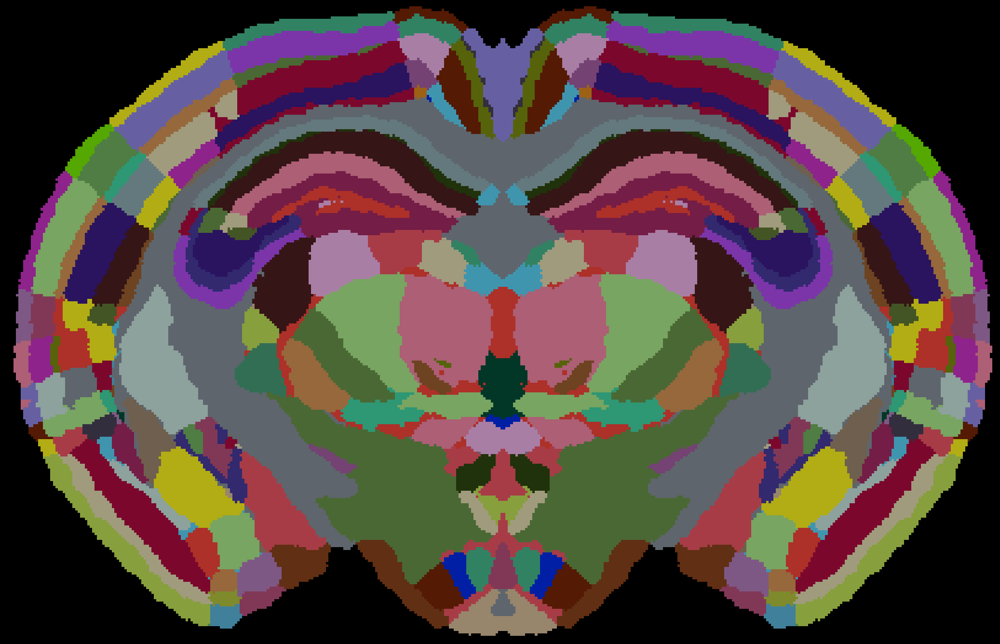

# An atlas for the prairie vole _Microtus ochrogaster_ has been added to BrainGlobe
Prairie voles are a valuable model species for studying social interaction due to their characteristic pair-bonding behavior. 
The brain of this species is structured similarly to the mouse and is only 30% larger, meaning it is particularly well suited to methods to map 
brain anatomy and function using light microscopy, such as light-sheet fluorescence microscopy and serial section two-photon microscopy.

To fully adopt these brain mapping techniques, a brain atlas is required (to use with tools such as 
[brainreg](/documentation/brainreg/index)). Such an atlas was created by 
[Gustison et al. (2024)](https://doi.org/10.7554/eLife.87029.3), and has been packaged into the BrainGlobe format by
Sacha Hadaway-Andreae in collaboration with the BrainGlobe team.

**Figure 1. Coronal view of the prairie vole brain atlas annotations.**

This atlas can now be used within the BrainGlobe ecosystem, with the atlas name: `prairie_vole_25um`.

## How do I use the new atlas?

You can use the prairie vole atlas for visualisation like other BrainGlobe atlases. To visualise the atlas, you could follow the steps below:

* Install BrainGlobe ([instructions](/documentation/index))
* Open napari and follow the steps in our [download tutorial](/tutorials/manage-atlases-in-GUI.md) for the prairie vole atlas
* Visualise the different parts of the atlas as described in our [visualisation tutorial](/tutorials/visualise-atlas-napari)

To use the atlas with other software such as [brainreg](/documentation/brainreg/index), please follow the instructions 
for those tools, and simply choose this atlas from the user interface.

## Why are we adding new atlases?

A fundamental aim of the BrainGlobe project is to make various brain atlases easily accessible by users across the globe. If you would like to get involved with a similar project, please [get in touch](/contact).
