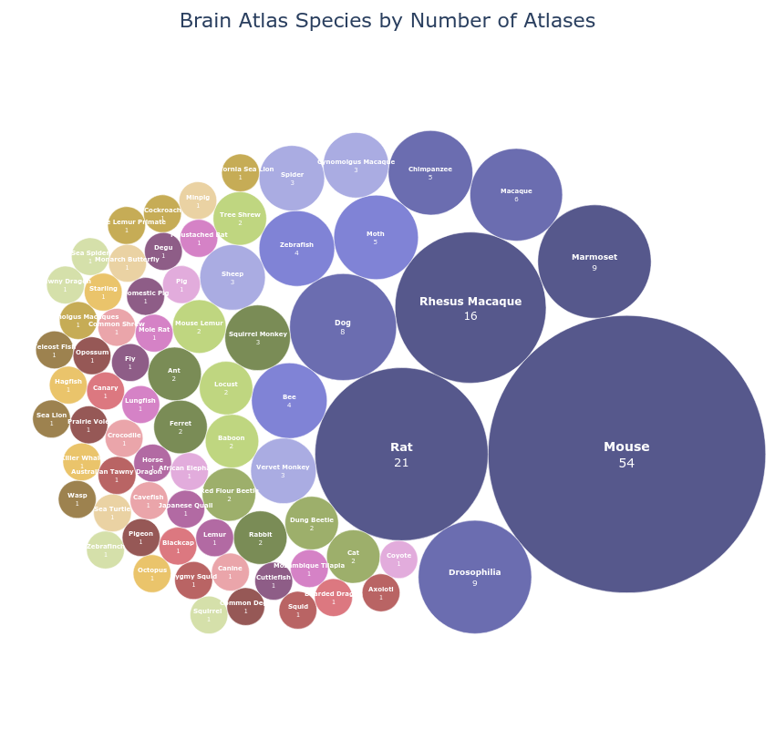

# The Systematic Atlas Packaging Project

The purpose of the BrainGlobe Atlas API is to standardise atlases and provide them to researchers via a common, easy to use, interface. As part of this initiative we have integrated atlases of all kinds, including atlases of mice, rats, bees, cuttlefish, and more. The logical endpoint of all of this would be integrate _all_ existing 3D atlases into BrainGlobe. 

While this may be a long process we have decided to get started. First by creating a comprehensive list of all published non-human brain atlases which is available [here](https://docs.google.com/spreadsheets/d/18_ow4llQQVuwKu5WWM3PsZ1SjmeNYAhi6eENzhQRc40/edit?usp=sharing). This list is a work in progress and if you find an atlas which is not mentioned please open an issue on the [brainglobe-atlasapi](https://github.com/brainglobe/brainglobe-atlasapi/issues?q=sort%3Aupdated-desc+is%3Aissue+is%3Aopen) repository and we will be sure to add it. 

The second step is to actually integrate the atlases on this list into the API. To this end [Jung Woo Kim](https://github.com/kjungwoo5) and [Amirreza Bahramani](https://github.com/bahramani) have joined the BrainGlobe team. They have already begun integrating several atlases (expect to see a Macaque atlas soon!). 

In total our review found 221 3D atlases across approximately 89 species of which we could find shared data for 121. 

As always, if you would like to get involved with this project just get in touch with us! There are several ways to contribute including adding missing atlases to the list, helping with data standardisation, or contributing to integration and validation. [Reach out to us](https://brainglobe.info/contact.html) if you would like to get involved. 

