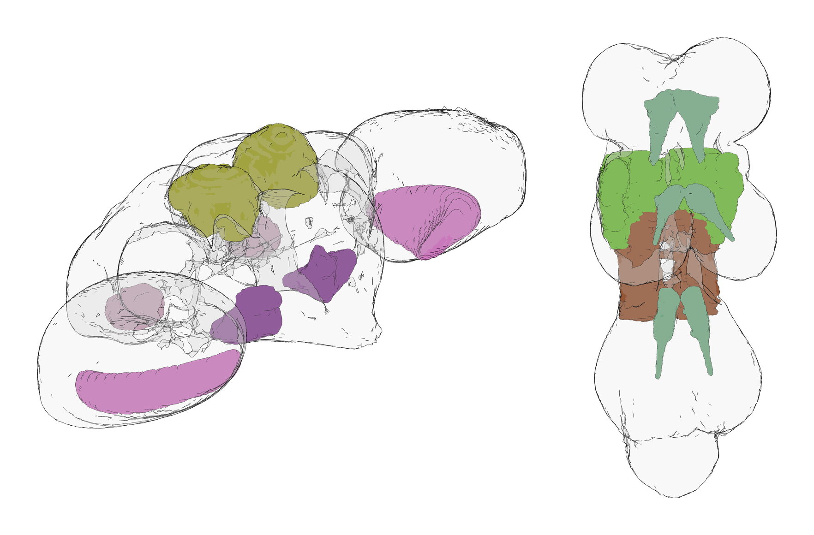

# Two Virtual Fly Brain atlases of the adult fruit fly nervous system have been added to BrainGlobe

Two atlases based on the JRC2018 unisex templates are now available through
BrainGlobe, bringing complementary views of the adult fruit fly
(_Drosophila melanogaster_) nervous system into the same software ecosystem.
Both atlases use data from [Virtual Fly Brain
(VFB)](https://www.virtualflybrain.org/) and the unbiased, symmetric templates
described by [Bogovic et al. (2020)](https://doi.org/10.1371/journal.pone.0236495).
One provides VFB-painted neuropil ROI annotations for the adult brain; the
other provides neuropil and domain annotations for the adult ventral nerve
cord (VNC).



**Figure 1. Selected labelled regions visualised with `brainrender`: brain
neuropils AL, CA, IPS, and LOP (left), and VNC domains WTct, HTct, and mVAC
(right). The root meshes are shown as outlines.**

## JRC2018Unisex brain neuropils atlas

The brain atlas packages the [JRC2018Unisex adult fly brain template and
VFB-painted neuropil regions](https://www.virtualflybrain.org/blog/2022/01/01/jrc-2018-templates-rois-jrc2018/).
It includes the reference and annotation images, region metadata, and VFB's
original meshes, reoriented into BrainGlobe space.

* **Atlas name:** `vfb_jrc2018u_neuropils_fly`
* **Resolution:** 0.5189161 × 1.0 × 0.5189161 µm
* **Template space:** JRC2018Unisex (`VFB_00101567`)
* **Coverage:** adult brain neuropils
* **Species:** _Drosophila melanogaster_
* **Annotations:** 46 neuropil regions plus the root structure, arranged as a
  flat atlas

The JRC2018U neuropils atlas has anisotropic voxel spacing, so in current
`brainrender-napari` views its proportions may appear distorted, with one axis
stretched relative to the others. The packaged atlas data are unchanged, and
viewer support for anisotropic atlases is being improved.

## JRC2018Unisex VNC atlas

The VNC atlas combines the JRC2018UnisexVNC template with the adult VNC
neuropil and domain annotations presented in the systematic nomenclature of
[Court et al. (2020)](https://doi.org/10.1016/j.neuron.2020.08.005) and made
available through [VFB](https://www.virtualflybrain.org/term/adult-vnc-neuropils-court2020-court2020/).
As in the brain atlas, the package includes VFB's source meshes alongside the
reference image, annotation image, and structure metadata.

* **Atlas name:** `vfb_jrc2018u_vnc_fly`
* **Resolution:** 0.4 µm isotropic
* **Template space:** JRC2018UnisexVNC (`VFB_00200000`)
* **Coverage:** adult ventral nerve cord neuropils and domains
* **Species:** _Drosophila melanogaster_
* **Annotations:** 20 visible non-root regions derived from 21 source ROI
  domains, arranged as a flat atlas


**Figure 2. Animated views through the reference and annotation images for the
brain neuropils atlas (left) and VNC atlas (right).**

## Source and citation

Please cite the JRC2018 template publication when using either atlas:

Bogovic JA, Otsuna H, Heinrich L, et al. An unbiased template of the
_Drosophila_ brain and ventral nerve cord. _PLOS ONE_. 2020;15(12):e0236495.
[https://doi.org/10.1371/journal.pone.0236495](https://doi.org/10.1371/journal.pone.0236495)

When using the VNC atlas, please also cite the source nomenclature publication:

Court RC, Namiki S, Armstrong JD, et al. A systematic nomenclature for the
_Drosophila_ ventral nerve cord. _Neuron_. 2020;107(6):1071-1079.e2.
[https://doi.org/10.1016/j.neuron.2020.08.005](https://doi.org/10.1016/j.neuron.2020.08.005)


## How do I use the new atlases?

You can use these atlases for visualisation and analysis like other BrainGlobe
atlases. To visualise them, you can:

* Install BrainGlobe ([instructions](/documentation/index)).
* Open napari and follow our [atlas download
  tutorial](/tutorials/manage-atlases-in-GUI.md), selecting either
  `vfb_jrc2018u_neuropils_fly` or `vfb_jrc2018u_vnc_fly`.
* Visualise the reference image, annotations, and meshes as described in our
  [visualisation tutorial](/tutorials/visualise-atlas-napari).

They can also be loaded programmatically with the BrainGlobe Atlas API:

```python
from brainglobe_atlasapi import BrainGlobeAtlas

brain_atlas = BrainGlobeAtlas("vfb_jrc2018u_neuropils_fly")
vnc_atlas = BrainGlobeAtlas("vfb_jrc2018u_vnc_fly")
```

## Why are we adding new atlases?

A fundamental aim of the BrainGlobe project is to make brain atlases and other
anatomical reference resources easily accessible to researchers across the
globe. If you would like to contribute a similar atlas, please [get in
touch](/contact).
