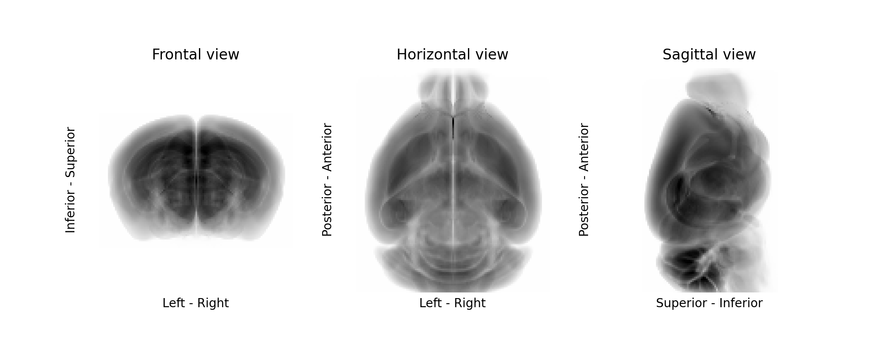

# BG-Space

## Introduction
Working with anatomical images, one often encounters the problem of matching the orientation of stacks with different conventions about axes orientation and order. Moreover, when multiple swaps and flips are involved, it can be annoying to map the same transformations to volumes and points \(e.g., coordinates or meshes\).

`bg-space` provides a neat way of defining an anatomical space, and of operating stacks and point transformations between spaces.

## Installation

You can install `bg-space` with:

```text
pip install bg-space
```

## Usage

To define a new anatomical space, it is sufficient to give the directions of the stack origin position:

```python
source_origin = ("Left", "Superior", "Anterior")
target_origin = ("Inferior", "Posterior", "Right")
```

A stack can be then easily transformed from the source to the target space:

```python
import bg_space as bg
import numpy as np
stack = np.random.rand(3, 2, 4)

mapped_stack = bg.map_stack_to(source_origin, target_origin, stack)
```

The transformation is handled only with numpy index operations; _i.e._, no complex image affine transformations are applied. This is often useful as the preparatory step for starting any kind of image registration.

A shortened syntax can be used to define a space using initials of the origin directions:

```python
mapped_stack = bg.map_stack_to("lsa", "ipr", stack)
```

:::{note}  When you work with a stack, the origin is the upper left corner when you show the first element `stack[0, :, :]` with matplotlib or when you open the stack with ImageJ. First dimension is the one that you are slicing, the second the height of the image, and the third the width of the image.
:::

### The `SpaceConvention` class

Sometimes, together with the stack we have to move a set of points \(cell coordinates, meshes, etc.\). This introduces the additional complexity of keeping track, together with the axes swaps and flips, of the change of the origin offset.

To handle this situation, we can define a source space using the `SpaceConvention` class, specifying also the stack shape:

```python
stack = np.random.rand(3, 2, 4)  # a stack in source space
annotations = np.array([[0, 0, 0], [2, 1, 3]])  # related point annotations

source_space = bg.SpaceConvention(target_origin, stack.shape)

mapped_stack = source_space.map_stack_to("ipr", stack)  # transform the stack
mapped_annotations = source_space.map_points_to("ipr", annotations)  # transform the points
```

The points are transformed through the generation of a transformation matrix. Finally, if we want to log this matrix \(e.g., to reconstruct the full transformations sequence of a registration\), we can get it:

```python
target_space = bg.SpaceConvention("ipr", stack.shape)
transformation_matrix = SpaceConvention.transformation_matrix_to(target_space)
# equivalent to:
transformation_matrix = SpaceConvention.transformation_matrix_to("ipr", stack.shape)
```

The target get always be defined as a `bg.SpaceConvention` object, or a valid origin specification plus a shape \(the shape is required only if axes flips are required\).

### Matching space resolutions and offsets

The `SpaceConvention` class can deal also with stack resampling/padding/cropping. This requires simply specifying values for resolutions and offsets when instantiating a `SpaceConvention` object. Once that is done, using `SpaceConvention.transformation_matrix_to` creating affine transformation matrices from one space to the other will be a piece of cake!

```python
source_space = bgs.SpaceConvention("asl", resolution=(2, 1, 2), offset=(1, 0, 0))
target_space = bgs.SpaceConvention("sal", resolution=(1, 1, 1), offset=(0, 0, 2))
source_space.transformation_matrix_to(target_space)
```

Moreover, we can now use those space objects to resample stacks, and to generate stacks matching a target shape with the correct padding/cropping simply by specifying a target offset:

```python
source_space = bgs.SpaceConvention("asl", resolution=(2, 1, 2), offset=(1, 0, 0))
target_space = bgs.SpaceConvention("asl", resolution=(1, 1, 1), shape=(5, 4, 2))  # we need a target shape
source_space.transformation_matrix_to(target_space, stack, to_target_shape=True)
```

### Easy iteration over projections

Finally, another convenient feature of BG-Space is the possibility of iterating easily through the projections of the stack and generate section names and axes labels:

```python
sc = bg.SpaceConvention("asl")  # origin for the stack to be plotted

for i, (plane, labels) in enumerate(zip(sc.sections, sc.axis_labels)):
    axs[i].imshow(stack.mean(i))

    axs[i].set_title(f"{plane.capitalize()} view")
    axs[i].set_ylabel(labels[0])
    axs[i].set_xlabel(labels[1])
```



