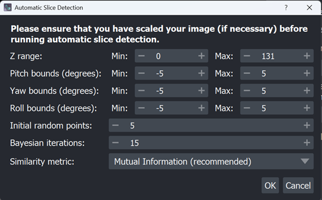

# automatic target selection widget

## Introduction

Previously, selecting the appropriate region of the atlas (i.e. the slice or
sub-volume to use as a registration target) was a **manual process**. Users
would visually scroll through atlas slices, estimate where their sample
belonged, and manually input corresponding rotation angles.

This process could be time-consuming and error-prone - especially when
working with noisy or partial data.

`automated_target_selection` enables **automatic atlas target selection**, 
integrated directly into the [brainglobe-registration](https://github.com/brainglobe/brainglobe-registration) 
Napari plugin.

## Details

The new `automated_target_selection` widget allows users to automatically 
determine the **best-matching slice and rotation parameters** (pitch, yaw, 
roll) of a [brainglobe-atlasapi](https://github.com/brainglobe/brainglobe-atlasapi) 
atlas for a given 2D sample image.

This serves as a pre-processing step before full registration and removes the 
guesswork from target selection.

The widget uses [Bayesian Optimisation](https://github.com/bayesian-optimization/BayesianOptimization) 
to iteratively find the atlas slice and orientation that maximises image 
similarity between your sample and candidate atlas slices.

## How to install

The widget is included in the latest version of `brainglobe-registration`.
You can install `brainglobe-registration` via [pip](https://pypi.org/project/pip/):

```
pip install brainglobe-registration
```
If already installed, upgrade to the latest version:
```
pip install brainglobe-registration --upgrade
```

Or install [via napari](https://napari.org/stable/plugins/start_using_plugins/finding_and_installing_plugins.html).

## How to use

After scaling your image in the *Prepare Images* section of the plugin, you 
can open the **Automatic Slice Detection** dialog. You can then define a few 
key parameters:



### 1. Z range

Use the Napari z-slider to estimate a rough region of the atlas that your 
sample might correspond to - e.g. slices 50 to 80. The optimisation will only 
search within this range.

If you are unsure, you can use the full atlas range (which is set by default).

### 2. Pitch / yaw / roll bounds (in degrees)

Rotation parameters help match the orientation of your sample to the atlas.

- **Pitch:** rotation around the **left-right** axis.
- **Yaw:** rotation around the **up-down** axis.
- **Roll:** rotation around the **front-back** axis.

Each parameter can be any integer between **-180 and +180**. You define the 
minimum and maximum value to search within - for example, pitch between -10 
and +10 degrees.

You can also preview what pitch, yaw, and roll look like using the manual 
refine sliders underneath the Automatic Slice Detection button.

### 3. Bayesian optimisation parameters

- **Initial random points:** the number of random points to sample before 
optimisation begins (default: 5).
- **Bayesian iterations:** number of optimisation steps (default: 15).

Bayesian optimisation works by first sampling a few random parameter 
combinations, then using a probabilistic model (a Gaussian process) to 
estimate which unexplored combinations are most promising. 

At each step, it balances exploration (trying new regions) and exploitation 
(refining near the current best result). This makes it much more efficient 
than a brute-force grid search.

### 4. Similarity metric

You can choose the metric used to score similarity between the sample and 
atlas slice.

• **MI (Mutual Information)**

Estimated via k-nearest neighbour entropy methods. MI measures statistical 
dependence between two images – it is zero if they are independent, and 
increases with stronger dependency.

• **NCC (Normalised Cross-Correlation):**

$$
NCC(A,B) = \frac{\sum_i (A_i - \bar{A})(B_i - \bar{B})}
{\sqrt{\sum_i (A_i - \bar{A})^2 \; \sum_i (B_i - \bar{B})^2}}
$$

Captures similarity in intensity patterns, invariant to linear rescaling 
of intensities.

• **SSIM (Structural Similarity Index):**

$$
SSIM(A,B) = 
\frac{(2\mu_A \mu_B + C_1)(2\sigma_{AB} + C_2)}
{(\mu_A^2 + \mu_B^2 + C_1)(\sigma_A^2 + \sigma_B^2 + C_2)}
$$

Captures perceptual differences in structure, luminance, and contrast.

• **Combined:**

Weighted combination of MI, NCC, and SSIM. You can customise the weight for 
each metric.

### 5. Start the optimisation

Once parameters are confirmed, click **OK**. A progress bar will appear while 
optimisation runs. When complete, the best-matching slice and rotation will 
be displayed in the Napari viewer.

You can continue to fine-tune results manually using the **pitch, yaw, and 
roll sliders.**

## Slab detection mode

The Automatic Slice Detection widget supports both single-slice and slab 
detection.

The widget will **automatically detect** whether your moving image is a 
single 2D slice or a 3D slab of multiple slices, and run the appropriate 
optimisation procedure.

How slab detection works:

1.	The optimiser first matches the **first and last slices** of your slab to 
the atlas using Bayesian optimisation.
2.	It then interpolates the atlas Z-indices and rotation parameters (pitch, 
yaw, roll) for all intermediate slices.
3.	The slab is reconstructed into the atlas space, and your moving image is 
automatically aligned as a 3D block.
4.	As you scroll through Z in Napari, the pitch, yaw, and roll spinboxes 
dynamically update to reflect the per-slice parameters.

### Handling slab-to-atlas alignment:

Depending on the relative depth of your slab compared to the atlas Z-range 
between the matched endpoints, three cases are handled automatically:

•	**Case 1 (Expansion):** If the atlas depth between the matched endpoints 
is smaller than the slab, the target range is expanded outward until the 
number of slices matches.

•	**Case 2 (Exact Match):** If the atlas depth exactly equals the slab 
depth, the slab is directly mapped slice-for-slice.

•	**Case 3 (Subsampling):** If the atlas depth is larger than the slab, 
slices are subsampled across the range to match the number of slab slices.

## Logging and results

All results, including the best slice and orientation, the final score, and 
the optimisation parameters, are saved to a logging file. You can find this 
in your system’s BrainGlobe directory:

```
<Path to your home directory>/.brainglobe/brainglobe_registration_logs/
```

This path is automatically created the first time you use BrainGlobe tools. 
The logs can help you keep track of your registration parameters across 
sessions.

In addition to .txt summary logs, **detailed optimisation history** is also 
stored. This includes:

•	**Per-iteration images:** the rotated atlas slice evaluated at each 
optimisation step is saved as an image. These are stored in subfolders named 
_coarse_XXX_ (pitch/yaw/z search) and _fine_XXX_ (roll search).

•	**Rotation matrices:** the 3×3 transformation matrix used for each 
candidate slice is logged as a JSON-style object.

•	**Metadata:** Each saved image and data object is annotated with 
iteration parameters (pitch, yaw, roll, z-slice) and the similarity score.

•	**Final summary:** the optimal pitch, yaw, roll, and z-slice are printed 
to the log, along with scores before and after roll optimisation.

These logs make it possible to retrace the entire optimisation process, 
visually inspect why certain parameters were chosen, and reuse parameter 
values for later experiments.

## Recommended parameters and trade-offs

•	**Z range:** Narrowing the range (e.g., 20 slices instead of the full 
atlas) significantly reduces computation time while maintaining accuracy. 
If unsure, start broad and refine later.

•	**Rotation bounds:** If your sample is roughly aligned, set tighter pitch/
yaw/roll bounds (±10–15°). Wider ranges (±90–180°) allow for more flexibility 
but increase optimisation time.

•	**Bayesian iterations:** More iterations improve accuracy but linearly 
increase runtime. For typical use, 10–20 iterations provide a good balance 
between speed and precision.

•	**Similarity metric:** MI or the Combined metric often provide the most 
robust alignment for noisy or partial data, though the best practice is to 
test multiple metrics to see which performs best for your dataset.
