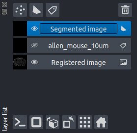

# Analysing segmentation from other napari plugins

## Introduction
While manual analysis of regions can be effective for various applications, there are instances where automated methods 
are necessary. In such cases, [other napari plugins](https://www.napari-hub.org/) can be used. 

Plugins exist to segment 
 many features common to biomedical images, and their results can be incorporated with BrainGlobe to analyse 
the distribution of features of interest within the context of an anatomical atlas. 

To be compatible with `brainglobe-segmentation`, the third-party napari plugin must be able to take a 3D image layer as 
input and return one of:
- A 3D labels layer with either a 2 or 3D region labeled (e.g., segmenting bulk axonal projections)
- A 3D points layer with a series of points corresponding to a trajectory through 3D space

:::{hint}
It is possible to segment structures outside the `brainglobe-segmentation` plugin and import them in later (e.g., by 
saving to a `.tiff` and reloading). However, it is simpler to load the data using `brainglobe-segmentation` and then segment 
it using a third-party plugin. This ensures that the coordinate spaces you are using are consistent. 
:::

## Instructions
### Segmenting your feature of interest
- Open napari
- Install the napari plugin you require to segment your data. To find out which plugins are available, see the 
[napari hub](https://www.napari-hub.org/).
- [Load your data using the `brainglobe-segmentation` plugin](/documentation/brainglobe-segmentation/user-guide/index)
- Use the plugin to segment your feature of interest. Ensure it returns a 3D labels or points layer.

:::{hint}
There are many plugins available, and we can't recommend a single tool for all data. For simple segmentation of 3D 
structures we often use 
[`napari-simpleitk-image-processing`](https://www.napari-hub.org/plugins/napari-simpleitk-image-processing). Another 
useful tool (also by [Robert Haase](https://github.com/haesleinhuepf)) is 
[`napari-segment-blobs-and-things-with-membranes`](https://www.napari-hub.org/plugins/napari-segment-blobs-and-things-with-membranes).
:::

### Analyse the segmented layer
:::{hint}
At this point you could load a layer segmented previously and saved to disk
:::

- If required, rename the layer to be analysed
- Click either the `Track tracing` or `Region segmentation` buttons to load the respective panels. 
- Highlight the layer to be analysed in the napari layers list:

- Click either the `Add track from selected layer` or `Add region from selected layer` button as applicable. This will
add the region/points from the layer to the `brainglobe-segmentation` analysis list (in the same way as if it had been 
analysed manually within `brainglobe-segmentation`).
- Follow the instructions for either:
  - [1D track analysis](../../../tutorials/segmenting-1d-tracks)
  - [2/3D region analysis](../../../tutorials/segmenting-3d-structures)

:::{note}
All data will be saved into your brainreg output directory
:::