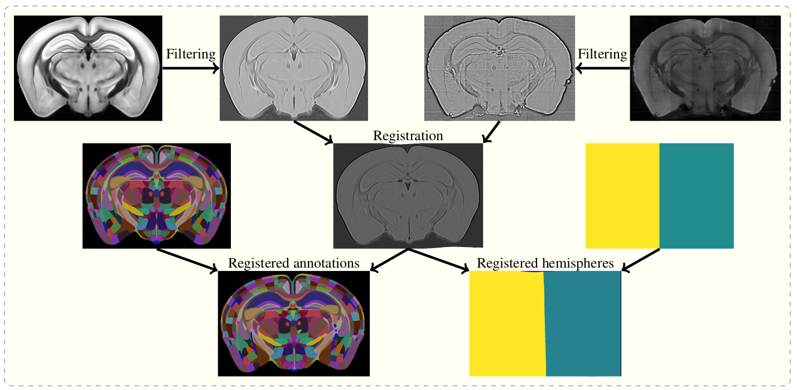

# brainreg

brainreg is an update to [amap](https://github.com/SainsburyWellcomeCentre/amap-python) (itself a port of the 
[original Java software](https://www.nature.com/articles/ncomms11879)) to include multiple registration backends, 
and to support the many atlases provided by [bg-atlasapi](https://github.com/brainglobe/bg-atlasapi).

Currently, the only registration backend is [NiftyReg](http://cmictig.cs.ucl.ac.uk/wiki/index.php/NiftyReg).

## Details

The aim of brainreg is to register the template brain (e.g. from the 
[Allen Reference Atlas](https://mouse.brain-map.org/static/atlas)) to the sample image. Once this is complete, any 
other image in the template space can be aligned with the sample (such as region annotations, for segmentation of 
the sample image). The template to sample transformation can also be inverted, allowing sample images to be aligned 
in a common coordinate space.

To do this, the template and sample images are filtered, and then registered in a three-step process (reorientation, 
affine registration, and freeform registration.) The resulting transform from template to standard space is then applied to the atlas.

Full details of the process are in the [original paper](https://www.nature.com/articles/ncomms11879).



## How to install
```{toctree}
:maxdepth: 2
installation
```

## User guide
```{toctree}
:maxdepth: 2
user-guide/brainreg-napari
user-guide/brainreg-cli
user-guide/parameters
user-guide/checking-orientation
user-guide/output-files
user-guide/visualisation
troubleshooting
```


## Citation

If you find brainreg useful and use it in your research, please let us know and also cite the paper:

> Tyson, A. L., V&eacute;lez-Fort, M.,  Rousseau, C. V., Cossell, L., Tsitoura, C., Lenzi, S. C., Obenhaus, H. A., Claudi, F., Branco, T.,  Margrie, T. W. (2022). Accurate determination of marker location within whole-brain microscopy images. Scientific Reports, 12, 867 [doi.org/10.1038/s41598-021-04676-9](https://doi.org/10.1038/s41598-021-04676-9)

Please also cite aMAP (the original pipeline from which this software is based):

>Niedworok, C.J., Brown, A.P.Y., Jorge Cardoso, M., Osten, P., Ourselin, S., Modat, M. and Margrie, T.W., (2016). AMAP is a validated pipeline for registration and segmentation of high-resolution mouse brain data. Nature Communications. 7, 1–9. https://doi.org/10.1038/ncomms11879

Lastly, if you can, please cite the BrainGlobe Atlas API that provided the atlas:

>Claudi, F., Petrucco, L., Tyson, A. L., Branco, T., Margrie, T. W. and Portugues, R. (2020). BrainGlobe Atlas API: a common interface for neuroanatomical atlases. Journal of Open Source Software, 5(54), 2668, https://doi.org/10.21105/joss.02668

**Don't forget to cite the developers of the atlas that you used (e.g. the Allen Brain Atlas)!**

