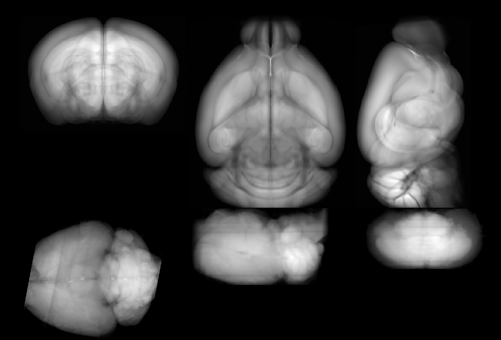

# Checking orientation

To ensure that the orientation is set correctly, `napari-brainreg` comes with a tool to interactively check the input 
orientation (thanks to [Jules Scholler](https://github.com/JulesScholler)!).

Once you've loaded your data, fill in the input orientation in the GUI based on the 
[brainglobe-space definition](/documentation/setting-up/image-definition) and click `Check orientation`. 
This will generate a number of new images that are displayed to the user. The top row of displayed images are the 
projections of the reference atlas. The bottom row are the projections of the aligned input data. If the two rows are 
similarly oriented, the orientation is correct. If not, change the orientation and try again.

## Incorrect orientation
Top is the reference atlas, averaged for all directions and bottom is the aligned input data with wrong input

## Correct orientation
Top is the reference atlas, averaged for all directions and bottom is the aligned input data with correct input

## A note about the camera position

In asymmetric cases (e.g. if you are registering to a single hemisphere or an asymmetric atlas), you may wonder about the camera position you are viewing the projections from. The origin of the projection image is at its top-left corner, the first axis runs top-down, and the second axis runs from left to right. 

For example, if the atlas is ASR, projection 1 (along the S-I axis) will have the anterior-most, right-most (AR) point on the top-left, with the A-P axis running from the top to the bottom of the screen, and the R-L axis running from left to right. This means you are viewing the brain from "below" (from inferior to superior).