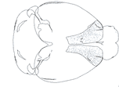

# Examples

Below is a gallery of examples using `brainrender`.

## Example List

Add Cell 

## Getting Started

To run these examples, install `brainrender` and ensure dependencies are properly set up.  
Find installation instructions in the [Installation Guide](installation.md).

## Contributing

Want to add your own example? Feel free to contribute by adding a new `.md` file inside the `examples` folder!

