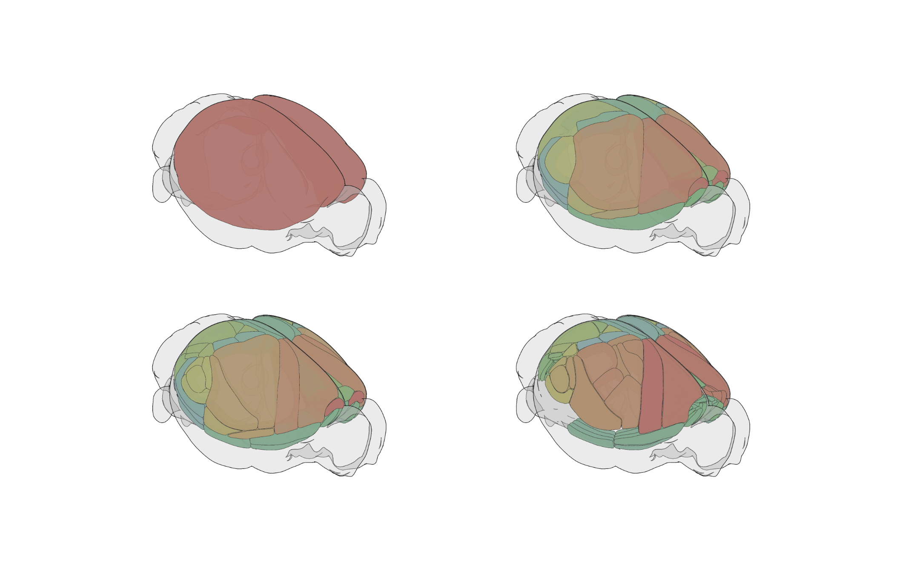
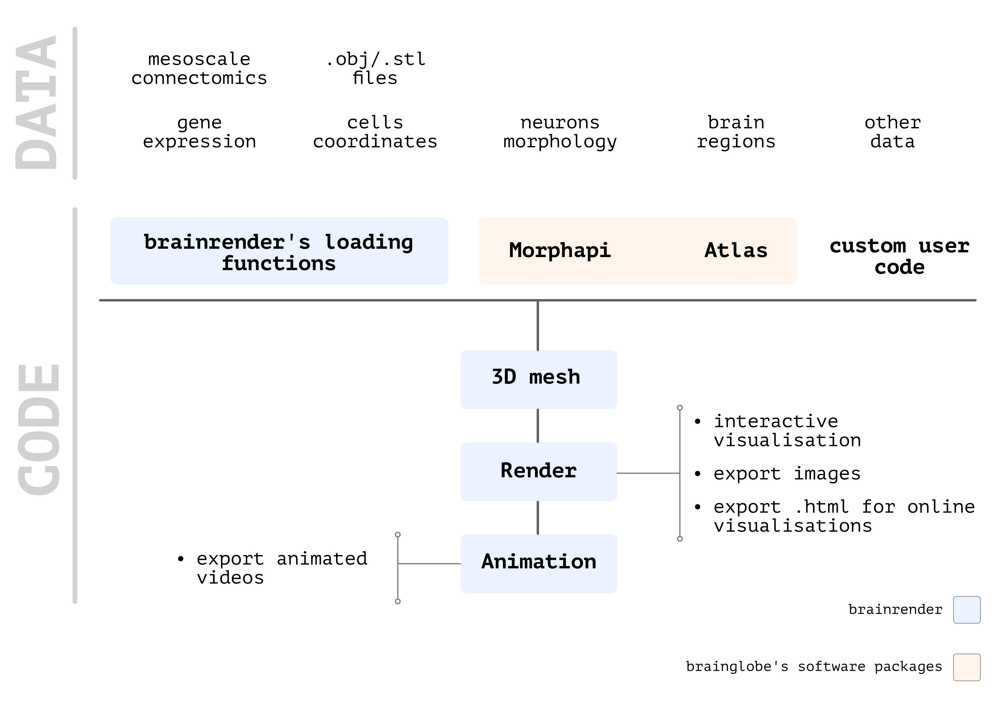

# brainrender

See [brainrender Quickstart](https://github.com/brainglobe/brainrender?tab=readme-ov-file#quickstart) for an example of how to create and render scenes.

## Introduction




A core design goal is to facilitate the rendering of any data registered to a reference atlas. To this end, 
`brainrender` facilitates the creation of 3D objects from many different types of data (e.g. cell locations, 
brain regions) within minimal need for the development of dedicated code. In addition, `brainrender` is fully 
integrated with the [BrainGlobe Atlas API](/documentation/brainglobe-atlasapi/index) ensuring that you can use `brainrender` 
with any atlas supported by the API with no need for any changes in your code.


Overview of brainrender's workflow

The general **workflow** for any `brainrender` visualization consists of just a few steps:

1. **Load** your data and generate a `brainrender` `Actor`. This can be done using custom code, or with the 
[dedicated `Actor` classes ](usage/actors)provided by `brainrender` which can be used to render most types of data.
2. **Add** your data to a `brainrender`[ `Scene`](usage/scene)
3. **Render** your scene, or use it to [create animated videos](usage/videos-animations-and-exporting-to-html).

To learn more in detail how to use `brainrender`, keep reading this documentation and when you're ready check out the 
examples at the [GitHub repository](https://github.com/brainglobe/brainrender).


### Using Notebooks

`brainrender` can be used with Jupyter notebooks, but some care must be used when doing that. 
Find more details [here](usage/using-notebooks.md).


### Full documentation
```{toctree}
:maxdepth: 2
installation
usage/index
```


### Citation

If you find brainrender useful and use it in your research, please let us know and also cite the paper:

>Claudi, F., Tyson, A. L., Petrucco, L., Margrie, T.W., Portugues, R.,  Branco, T. (2021) "Visualizing anatomically registered data with Brainrender&quot; <i>eLife</i> 2021;10:e65751 [doi.org/10.7554/eLife.65751](https://doi.org/10.7554/eLife.65751)
