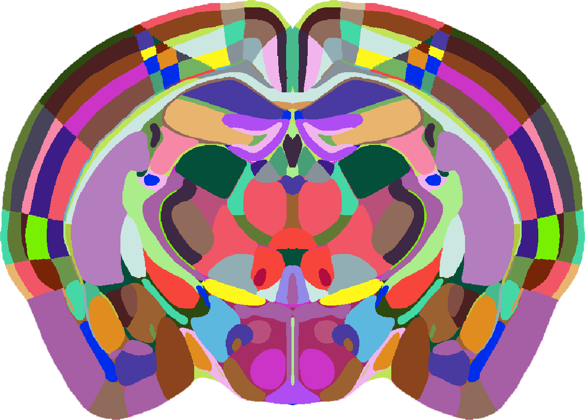
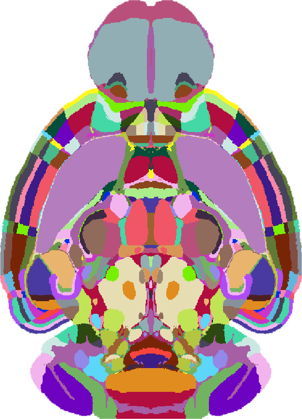

# Image space definition

In some BrainGlobe tools, you need to specify the orientation and resolution of the data.

## Orientation
When you need to specify the orientation of your data, you will usually need to enter a string in the 
[brainglobe-space](https://github.com/brainglobe/brainglobe-space) "initials" form, to describe the origin voxel.

When you work with a stack, the origin is the upper left corner when you show the first element `stack[0, :, :]` with 
matplotlib or when you open the stack with ImageJ. The first dimension is the one that you are slicing, the second is 
the height of the image, and the third is the width of the image.

If the origin of your data (first, top left voxel) is the most anterior, superior, left part of the brain, then the 
orientation string would be "asl" (anterior, superior, left), and you would use `asr`.

The order of the three initials must be the same as the axis order (sliced plane, height, width).

For help with setting the orientation, the brainreg napari plugin comes with a tool to interactively check the orientation 
([see documentation](/documentation/brainreg/user-guide/checking-orientation)).

### Examples

#### Coronal section
If the first plane of this image was olfactory bulb, it would be `asr` (or `asl`). If the first plane was cerebellum, it would be `psr` or `psl`.

#### Horizontal section
If the first plane of this image was the top of the brain it would be `sal`/`sar`. If the first plane was the base it would be `ial`/`iar`.

## Voxel sizes

You may also need to specify the size of your voxels. These voxel sizes are in microns, and come in the same order 
as your orientation definition.

As an example, we will assume, as above, the origin of your data (first, top left voxel) is the most anterior, superior, 
left part of the brain. If your plane spacing (i.e., the z-depth is 5 microns), and your in-plane resolution is 2x2 
microns, then the voxel sizes would be `5 2 2`.

## Napari 3D Orientation for brainrender

napari v0.6.0 and later use a **right-handed 3D coordinate system** by default, however brainrender expects a **left-handed system**, so 3D visualisations may appear mirrored (left-right flipped).  

To fix this:

1. Right-click the **Toggle 2D/3D view** button in the bottom-left corner.  
2. Select the pre-0.6.0 default: **away, down, right**.  

This ensures correct visualisation in brainrender.  
For more details on napari’s 3D axis directions and handedness, see the [napari documentation](https://napari.org/stable/guides/handedness.html).

