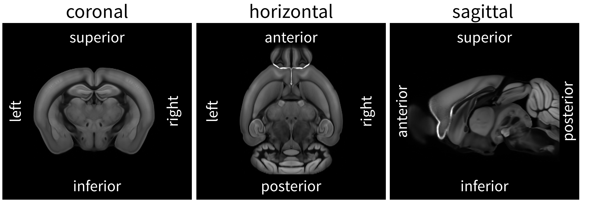
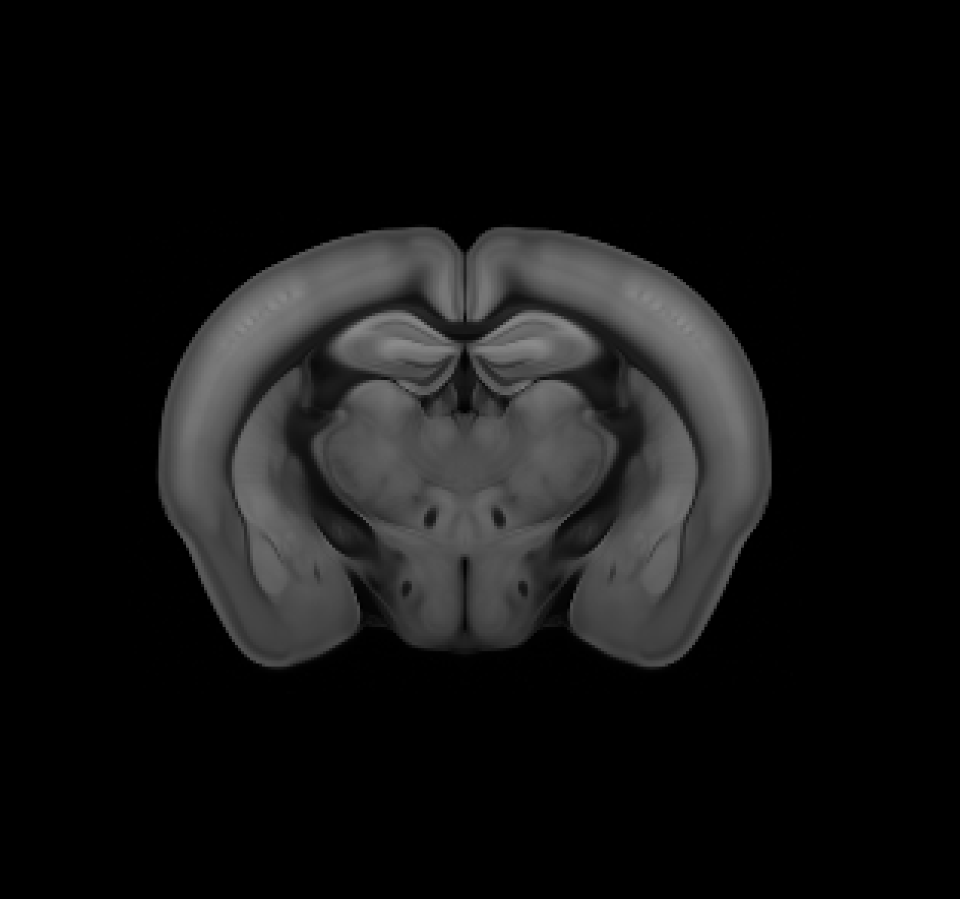
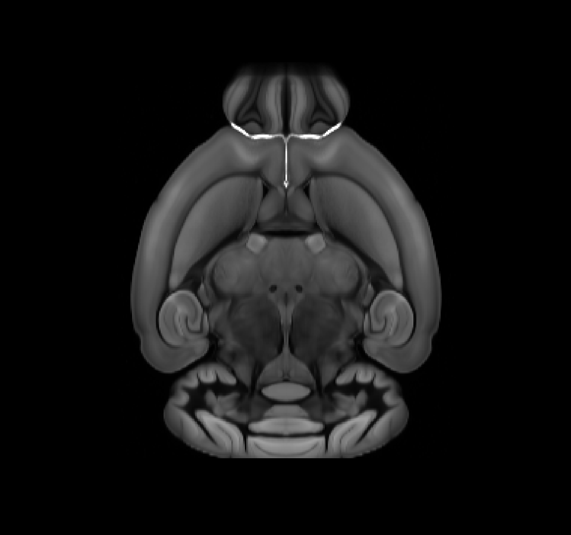
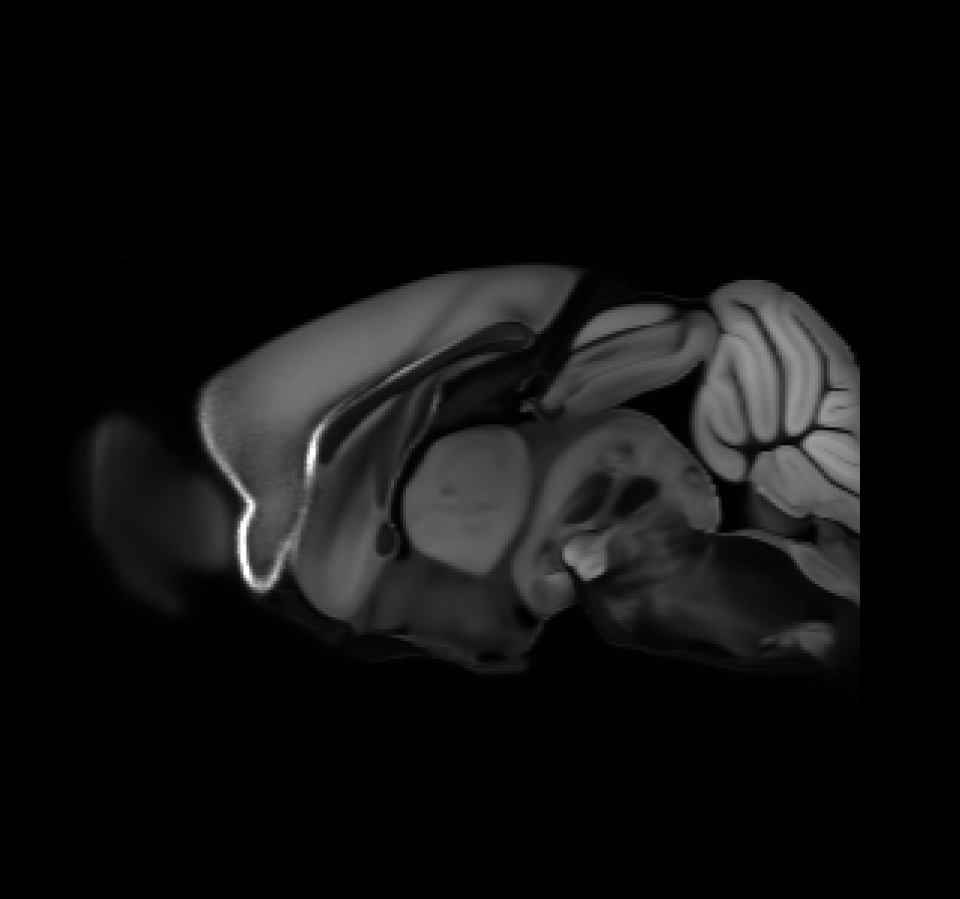

# Image space definition

In some BrainGlobe tools, you need to specify the orientation and resolution of the data.

## Axes
Misinterpreting axes can lead to mistakes when using BrainGlobe tools. So before you can specify the orientation and resolution of your data, it is a good idea to figure out which axis maps on to which dimension in the underlying data.

When you open an image in [napari](https://napari.org) or [Fiji](https://imagej.net/software/Fiji/), the default ordering of the axes is:
- Axis 0: Image depth 
- Axis 1: Image height
- Axis 2: Image width

:::{note}
BrainGlobe uses axis labels 0, 1, 2, instead of z, y, x. This is because the underlying data is stored as NumPy arrays, which use numeric indices for their dimensions. Mapping to z, y, x can lead to ambiguity because different mapping conventions exist. To avoid this, we label axes 0, 1, 2 referring directly to the structure of the underlying data and ensure our documentation matches how the data is represented. 
:::

## Dimensions in image stacks

By default, opening a 3D image in napari or Fiji displays it as a scrollable stack of 2D images. For example, when viewing the Allen Mouse Brain Atlas reference ([Wang et al., 2020](https://doi.org/10.1016/j.cell.2020.04.007)) in napari, the default image that appears is the one in the left panel where the the purple arrow indicates the direction of dimension 1, the blue arrow indicates the direction of dimension 2. Scrolling through the stack of images corresponds to dimension 0.

The order and direction in which the different dimensions are displayed can be changed. For example, by "rolling" the order of the visualised dimensions (see [`numpy.roll`](https://numpy.org/devdocs/reference/generated/numpy.roll.html)).

- **First roll**: [0 1 2] → [2 0 1] (middle panel)
- **Second roll**: [2 0 1] → [1 2 0] (right panel)

## napari
After rearranging the axis order, the visualisation of the data changes. This is only a display effect, the underlying data structure remains unchanged. Axis 0, for example, might now correspond to image height instead of image depth.  

The [status bar](https://napari.org/dev/tutorials/fundamentals/viewer.html#status-bar) shows indices of any voxels that are currently hovered over, depending on which layer is selected. These voxel indices always reflect the structure of the underlying data. They can therefore be relied on to figure out which dimension maps to which axis.

### Using the voxel coordinate to determine axis order
To confirm the axis order, observe how the voxel indices change when you scroll through the images and move the cursor over the image vertically or horizontally.

| Action                       | Changing coordinate | 
|:-------------------------------|:--------------------| 
| Scrolling through images (depth)     | [**0** 1 2]         | 
| Moving the cursor vertically (height)   | [0 **1** 2]         | 
| Moving the cursor horizontally (width) |[0 1 **2**]          | 

### Fiji
By default, Fiji opens image stacks so that the x-axis corresponds to axis 2 (image width), the y-axis corresponds to axis 1 (image height), and the z-axis corresponds axis 0 (image depth). The x, y, z coordinates in the status bar when you hover over the image. 

Unlike napari, in Fiji these refer to the display, not the underlying data structure. You can for example see this by using [Orthogonal Views](https://imagej.net/imaging/z-functions#orthogonal-views) to visualise 3D data. Each panel shows a different orientation of the image. However, hovering over the displayed images, shows the x coordinate is always image width and the y coordinate is always image height.

This means Fiji’s axis labels do not necessarily match the numeric axes (0, 1, 2) used by BrainGlobe, and these coordinates cannot be used to determine which axis is which when the display of the axes has been rearranged. So when using Fiji, make sure you are using the default view to determine which axis is which.

## Orientation
To describe the orientation of 3D brain imaging data in anatomical terms, [brainglobe-space](https://github.com/brainglobe/brainglobe-space) uses an anatomical description of the relative location of **the origin**—the voxel at position [0, 0, 0], which when you open the stack with [napari](https://napari.org/) by default corresponds with the pixel in the upper left corner of the first image in the stack. 

:::note
The position of the origin voxel can be verified by opening the image stack in Fiji or napari, selecting the first image, and hovering the cursor over the top-left region of that image. Check the status bar. It should report the coordinates `[0 0 0]`.
:::

The origin can be described by a three letter string in which each letter corresponds to one of the following **anatomical directions**:
- posterior (`p`) ↔ anterior (`a`)
- superior (`s`) ↔ inferior (`i`) 
- left (`l`) ↔ right (`r`)

The string includes one letter from each opposing pair, specifying the direction towards the origin for axes 0, 1, and 2 respectively.

*50 μm mouse brain atlas by [Wang et al., 2020](https://doi.org/10.1016/j.cell.2020.04.007), visualised in napari using the [brainrender-napari plugin](https://napari-hub.org/plugins/brainrender-napari.html)*.

### Examples
The examples below assume default ordering of the axes, i.e. axis 0 (image depth), axis 1 (image height), axis 2 (image width).

#### Coronal

If the stack of images starts at the olfactory bulb, moving toward the cerebellum, the anatomical directions for each axis are:
- Axis 0: anterior → posterior 
- Axis 1: superior → inferior 
- Axis 2: left → right

The origin voxel corresponds to the most anterior (`a`), superior (`s`), left (`l`) part of the brain, so the origin string is `asl`. 

If the stack would start at the cerebellum and move towards the olfactory bulb, then axis 0 runs posterior → anterior, and the origin string would be `psl`.

#### Horizontal

If the first image in the stack corresponds to the bottom of the brain, the origin voxel corresponds to the most inferior (`i`), anterior (`a`), left (`l`) part of the brain for axis 0, 1, and 2 respectively. In this case the origin string is `ial`.

#### Sagittal

If the stack is imaged from the left side of the brain toward the right, the origin corresponds to the most left (`l`), superior (`s`), anterior (`a`) part of the brain, so the origin string is `lsa`.

## Voxel sizes

You may also need to specify the size of your voxels. These voxel sizes are in microns, and come in the same order 
as your orientation definition.

As an example, we will assume, as above, the origin of your data (first, top left voxel) is the most anterior, superior, 
left part of the brain. If your plane spacing (i.e. the image depth) is 5 microns, and your in-plane resolution is 2x2 
microns, then the voxel sizes would be `5 2 2`.

## Napari 3D Orientation for brainrender

## Handedness

| Left-handed | Right-handed |
|-------------|--------------|
|  | |

*3D render of 25 μm mouse brain atlas by [Wang et al., 2020](https://doi.org/10.1016/j.cell.2020.04.007), visualised in napari with visible axes, using the [brainrender-napari plugin](https://napari-hub.org/plugins/brainrender-napari.html)*.

`napari v0.6.0` and later use a **right-handed 3D coordinate system** by default, however `brainrender` expects a **left-handed system**, so 3D visualisations may appear mirrored (left-right flipped).  

To change to a left-handed system

1. Right-click the **Toggle 2D/3D view** button in the bottom-left corner.  
2. Select the pre-0.6.0 default: **away, down, right**.  

This ensures `napari`'s visualisation matches `brainrender`'s.  
For more details on napari’s 3D axis directions and handedness, see the [napari documentation](https://napari.org/stable/guides/handedness.html).

