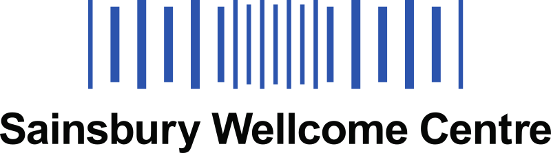
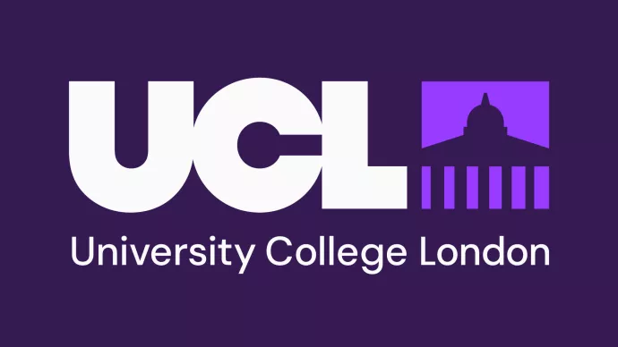
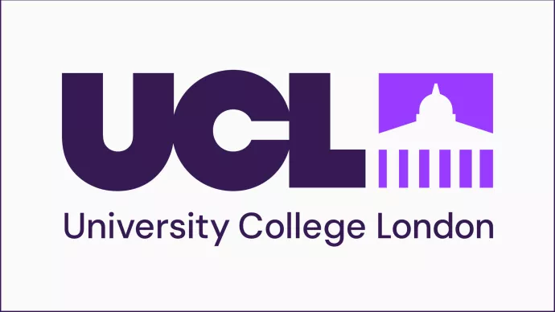
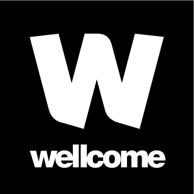
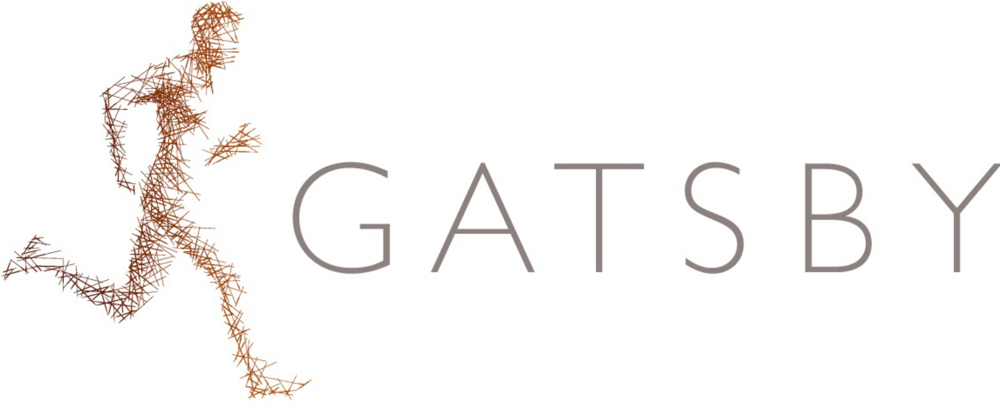
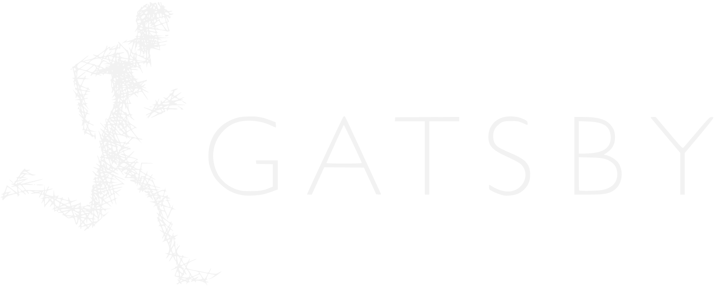
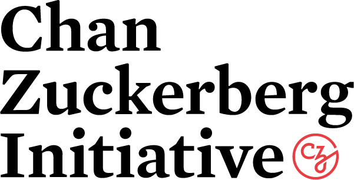
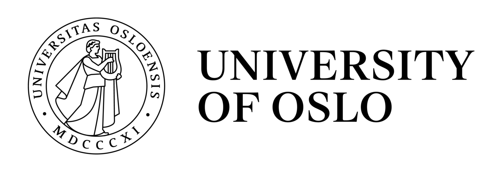
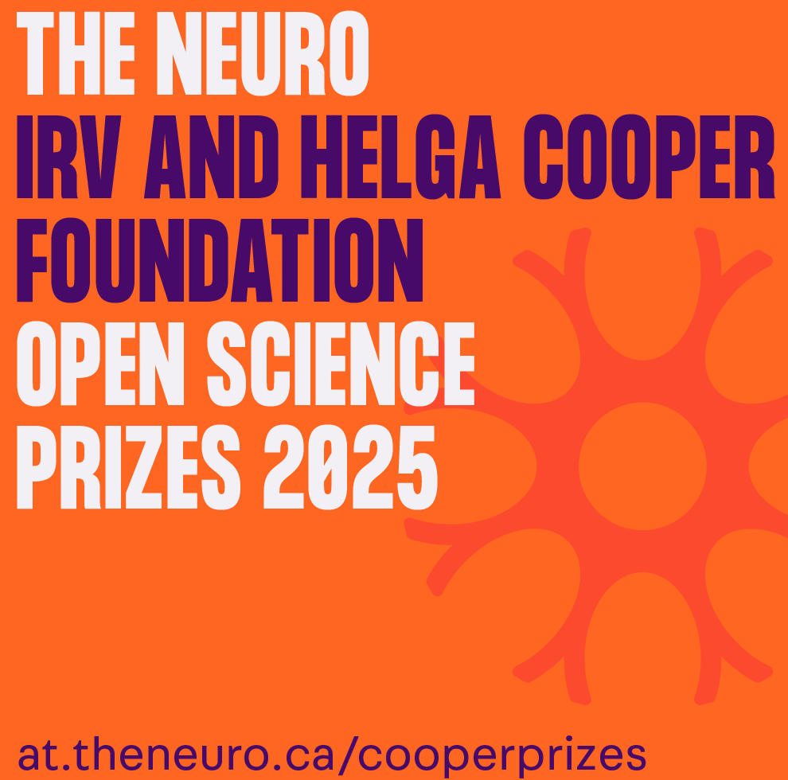
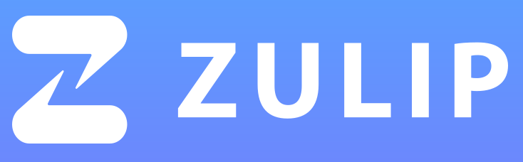

# Funders

The BrainGlobe project is only possible due to grant funding and the generous support of host institutions and other organisations.

    <a href="https://www.sainsburywellcome.org/" target="_blank">
    <a href="https://www.sainsburywellcome.org/" target="_blank">
    <a href="https://www.tum.de/en/" target="_blank">
    <a href="https://www.tum.de/en/" target="_blank">
    <a href="https://www.ucl.ac.uk/" target="_blank">
    <a href="https://www.ucl.ac.uk/" target="_blank">
    <a href="https://wellcome.org" target="_blank">
    <a href="https://wellcome.org" target="_blank">
    <a href="https://www.ucl.ac.uk/gatsby/gatsby-computational-neuroscience-unit" target="_blank">
    <a href="https://www.ucl.ac.uk/gatsby/gatsby-computational-neuroscience-unit" target="_blank">
    <a href="https://chanzuckerberg.com/" target="_blank">
    <a href="https://chanzuckerberg.com/" target="_blank">
    <a href="https://www.uio.no/english/" target="_blank">
    <a href="https://www.uio.no/english/" target="_blank">
    <a href="https://www.mcgill.ca/neuro/open-science/open-science-awards-and-prizes/neuro-irv-and-helga-cooper-foundation-open-science-prizes" target="_blank">
    <a href="https://www.mcgill.ca/neuro/open-science/open-science-awards-and-prizes/neuro-irv-and-helga-cooper-foundation-open-science-prizes" target="_blank">
    <a href="https://registry.opendata.aws/brainglobe/" target="_blank">
    <a href="https://registry.opendata.aws/brainglobe/" target="_blank">
    <a href="https://zulip.com/for/open-source/" target="_blank">
    <a href="https://zulip.com/for/open-source/" target="_blank">

