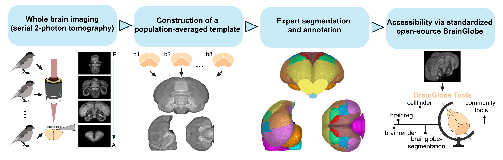

# A digital three-dimensional brain atlas for the blackcap (Sylvia atricapilla)

## Introduction
BrainGlobe provides a 
[consistent interface to existing anatomical atlases from many species](/documentation/brainglobe-atlasapi/index). However, 
digital 3D atlases do not exist for the majority of species. 

The Eurasian blackcap (*Sylvia atricapilla*) is a songbird known to navigate by the Earth's magnetic field, making it 
a very interesting animal model. However, the lack of a high quality reference atlas hinders computational neuroanatomy 
research in this species. Anatomical atlases define a standard coordinate system for an organ, and allow data from 
multiple sources to be aligned and then visualised and analysed together. This makes it easier to integrate results 
different sources, and facilitates data sharing and collaboration.

For this reason, we collaborated with [Simon Weiler](https://sites.google.com/view/neuroweiler) from the 
[Sainsbury Wellcome Centre](https://www.sainsburywellcome.org), and the lab of 
[Henrik Mouritsen](https://uol.de/en/ibu/animal-navigation) at the 
[Carl von Ossietzky University of Oldenburg](https://uol.de/en) to build a high-quality digital reference atlas 
of the blackcap brain.

## Process
Full details of the atlas generation process are available in the [preprint](), however it is briefly as follows:
1. Acquire high-resolution whole-brain images using the
[Sainsbury Wellcome Centre serial section two-photon platform](https://swc-advanced-microscopy.github.io/facility_webpage/)
2. Crop images to generate individual hemisphere images without damage (we used 18 hemispheres from 10 birds)
3. Iteratively generate a high signal-to-noise average template image from all the individual images using 
[ANTs](http://stnava.github.io/ANTs/) via an [optimised script](https://github.com/CoBrALab/optimized_antsMultivariateTemplateConstruction) 
from the [CoBra lab](https://www.cobralab.ca/)
4. Manually annotate brain regions using [ITK-SNAP](http://www.itksnap.org/pmwiki/pmwiki.php)
5. Package the template and annotations image [into the BrainGlobe format](https://brainglobe.info/documentation/brainglobe-atlasapi/adding-a-new-atlas.html)

:::{note}
The template generation process is simplified by 
[brainglobe-template-builder](https://github.com/brainglobe/brainglobe-template-builder). This tool will be further 
improved to allow others to create their own atlases.
:::

**Atlas generation process**

## Results
We have initially generated a template reference image at 25 micron isotropic resolution and annotated 23 brain regions. 
This atlas is available within BrainGlobe as `eurasian_blackcap_25um` and is compatible with all BrainGlobe tools.

To view BrainGlobe atlases in [napari](https://napari.org), please follow the 
[atlas visualisation tutorial](/tutorials/visualise-atlas-napari). 

**Blackcap atlas viewed coronally**

## Get involved
The blackcap atlas is version 1, and we anticipate releasing further versions at higher resolutions and with more 
regions annotated. If this atlas is useful for your work and would like to contribute, please [get in touch](/contact).

We are creating further novel atlases, and we'd be very happy to chat if you're also interested in making an 
atlas for your application. 

