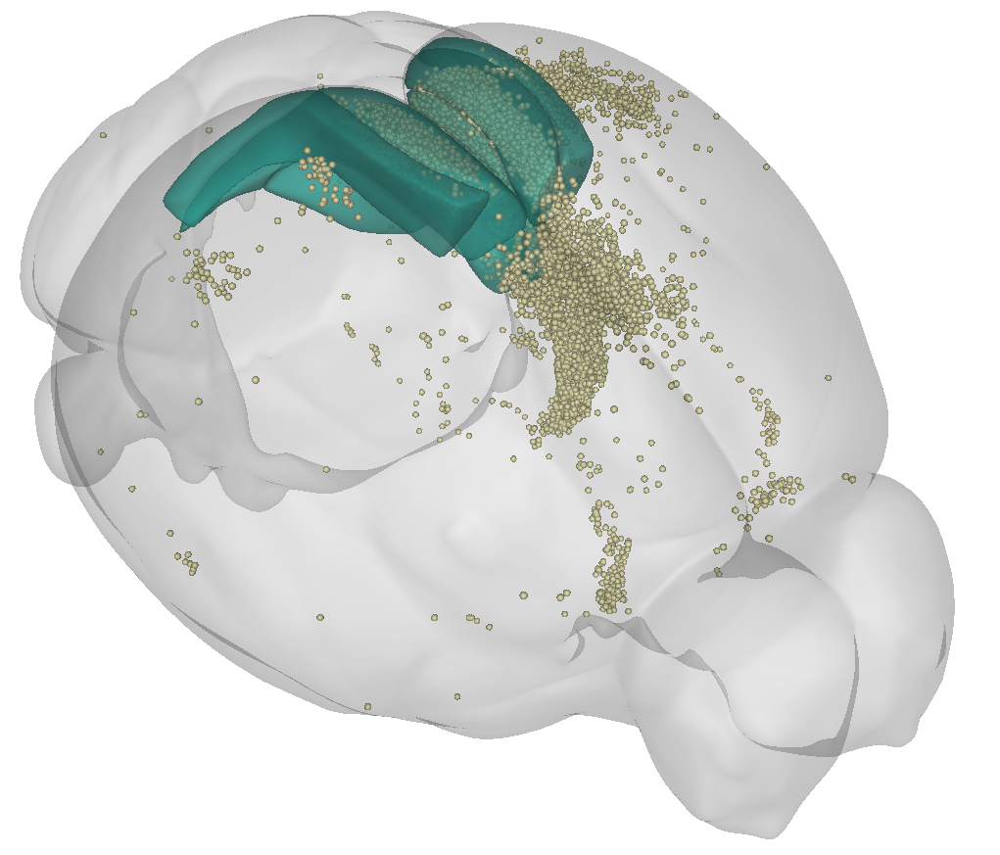

# Visualising your data in brainrender



To generate 3D figures of your data in atlas space, you can use [brainrender](/documentation/brainrender/index). 
brainmapper automatically exports a file in a brainrender compatible format, which can be found at 
`test_brain/output/points/points.npy`.

Once you've [installed brainrender](/documentation/brainrender/installation), you can try something like this:

```python
from brainrender.scene import Scene
from brainrender.actors import Points

cells_path = "test_brain/output/points/points.npy"

# initialise brainrender scene
scene = Scene()

# create points actor
cells = Points(cells_path, radius=45, colors="palegoldenrod", alpha=0.8)

# visualise injection site (retrosplenial cortex)
scene.add_brain_regions(["RSPd"], colors="mediumseagreen", alpha=0.6)
scene.add_brain_regions(["RSPv"], colors="purple", alpha=0.6)
scene.add_brain_regions(["RSPagl"], colors="mediumseagreen", alpha=0.6)

# Add cells
scene.add(cells)

scene.render()
```

:::{hint}
As the `points.h5`file contains the detected cells in atlas space, you can load cells from 
multiple brains (e.g., in a different colour).
:::
