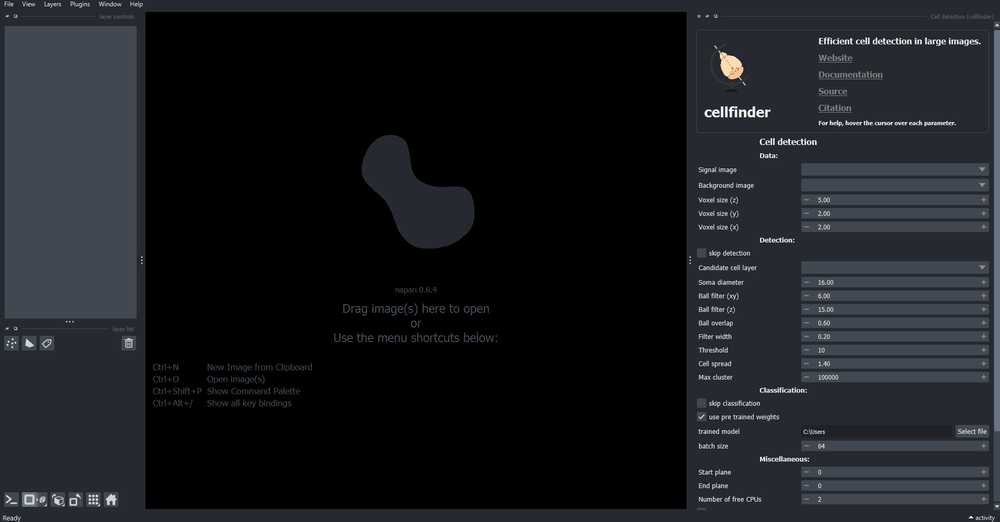
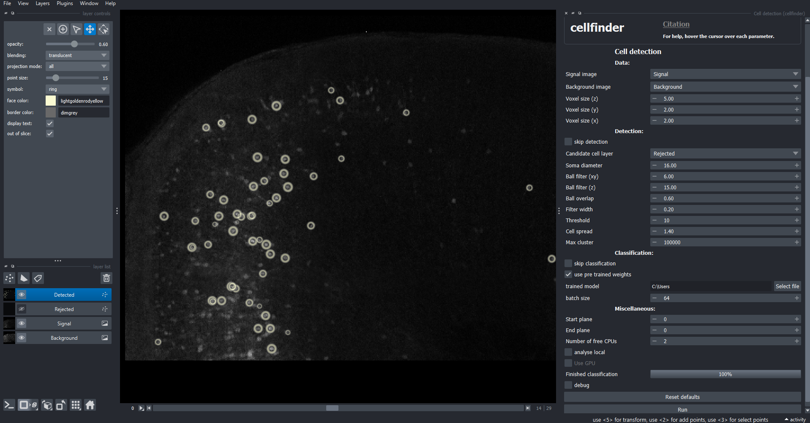

# Detecting cells in 3D with cellfinder

In this tutorial, you will use the [cellfinder](../documentation/cellfinder/index) plugin for [napari](https://napari.org) to detect cells in a 3D image. 

The aim of this tutorial is to get cell detection up and running. The image we use here is very small and has some 
artefacts. The results are not very good, but it should be enough to see the plugin working! When using cellfinder on 
your own data, there are many parameters that can be 
adjusted, and cellfinder will need to be retrained for optimal performance. For more information, please see the full 
[cellfinder documentation](../documentation/cellfinder/index).

:::{note}
You will need `napari` installed on your computer - please follow 
[`napari`'s installation instructions](https://napari.org/stable/tutorials/fundamentals/installation.html) to do so 
(including their recommendation to use a `conda` environment).
:::

1. Open `napari`.
2. Install `cellfinder` by selecting `Plugins > Install/Uninstall plugins` and searching for `cellfinder` in the searchbox. If it is not installed yet, click on the `Install` button.

:::{caution}
This may take a while due to the various dependencies being installed.

On Silicon Macs you may have to run `conda install hdf5` on the command line (in your conda environment) first for the installation to be successful.
:::

3. Open the cell detection widget by selecting `Plugins > cellfinder > Cell detection` in the napari menu bar near the top left of the window.
   

   **The cell detection widget appears on the right-hand side of the window.**

4. Load some sample data `File > Open sample > Sample data (cellfinder)`. This will open a small two-channel 3D image.
5. Set the `signal image` to `Signal`
6. Set the `background image` to `Background`
7. Ensure that `Voxel size (z)` is set to `5.00`, `Voxel size (y)` is set to `2.00`, and `Voxel size (x)` is set to `2.00`.
8. Click `Run` (you may need to scroll down)

   
   
   **Detected cells are highlighted by yellow circles.**

9. Ensure that the `Detected` layer is highlighted
8. Save the detected cells by clicking `File > Save selected layer(s)`, choosing a directory and a filename ending 
in `.xml` (e.g. `cells.xml`).

:::{hint}
For more information about how to use the detection plugin to detect cells in your own data, please see 
[the full cell detection guide](../documentation/cellfinder/user-guide/napari-plugin/cell-detection).
:::
