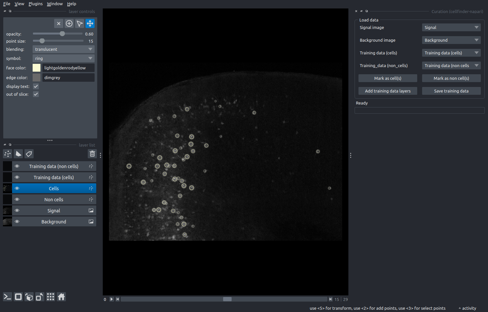
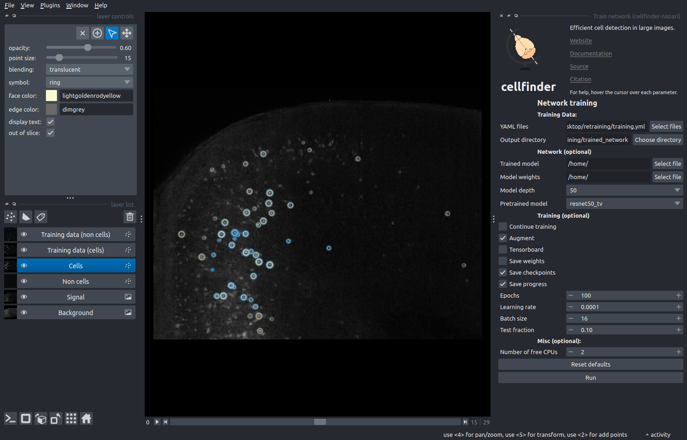

# Retraining the cellfinder classification network

In this tutorial, you will use the [cellfinder](../documentation/cellfinder/index) plugin for 
[napari](https://napari.org) to retrain the cell classification network.

The aim of this tutorial is to get up and running retraining cellfinder using a very small training dataset. When it 
comes to using cellfinder with your own data, it is very important to retrain the network properly. You also may want to
 use the command line tool instead of using napari. For more information, please see the full 
[cellfinder re-training documentation](../documentation/cellfinder/user-guide/training-strategy).

Before running this tutorial, please run the [cell detection tutorial](./cellfinder-detection) first.

:::{note}
You will need `napari` installed on your computer - please follow 
[`napari`'s installation instructions](https://napari.org/stable/tutorials/fundamentals/installation.html) to do so 
(including their recommendation to use a `conda` environment).
:::

1. Open `napari`.
2. Open the curation widget by selecting `Plugins > cellfinder-napari > Curation` in the napari menu bar near the top left of the window.
3. Load some sample data `File > Open sample > Sample data (cellfinder-napari)`. This will open the same small two-channel 3D image from the detection tutorial.
4. Click `Files > Open File(s)` and select the `cells.xml` from the curation tutorial. If napari prompts you to choose a plugin, choose `brainglobe-napari-io`.
5. Set the `signal image` to `Signal`
6. Set the `background image` to `Background`
7. Click `Add training data layers`

**The curation widget appears on the right-hand side of the window alongside the raw data with detected cells overlaid**

8. Highlight the `Cells` layer and then choose the `Select Points` tool by clicking the arrow in the layer controls 
widget, or pressing the `3` key on your keyboard.
9. Select some cells in the image by drawing a box and click `Mark as cell(s)`
10. Select some different cells in the image and click `Mark as non cell(s)`
11. Click `Save training data`
12. Create and then select a new directory on your computer (e.g. `cellfinder-retraining`) and click `Choose`.
13. Close the curation widget by clicking the `x` at the top left of the widget.
14. Open the retraining widget by selecting `Plugins > cellfinder-napari > Train network` in the napari menu bar near the top left of the window.
15. Select the data for retraining by clicking `Select files` next to `YAML files` and choose the `training.yml` file 
is inside the `cellfinder-retraining` directory created earlier
16. Choose a directory to save the training output, e.g., create a `trained_network` directory
17. Set `Epochs` 2

**The training widget appears on the right-hand side of the window.**

18. Click `run`
19. The training will then run, watch the terminal for updates. Once complete, there will be trained models
(files ending in `.h5`) in the `trained_network` directory that can be used for cell detection.

:::{hint}
For more information about how to use the curation and training plugins, please see 
[the full using cellfinder in napari guide](../documentation/cellfinder/user-guide/napari-plugin/index).
:::
