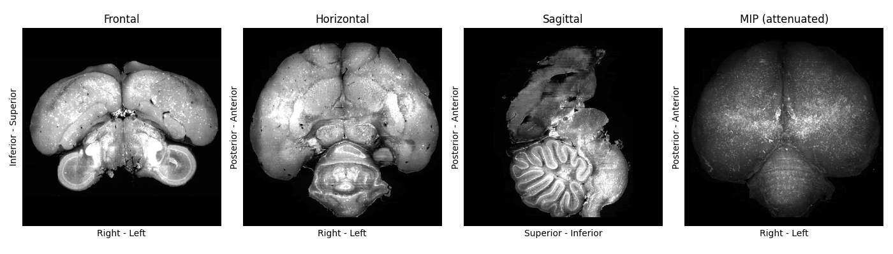
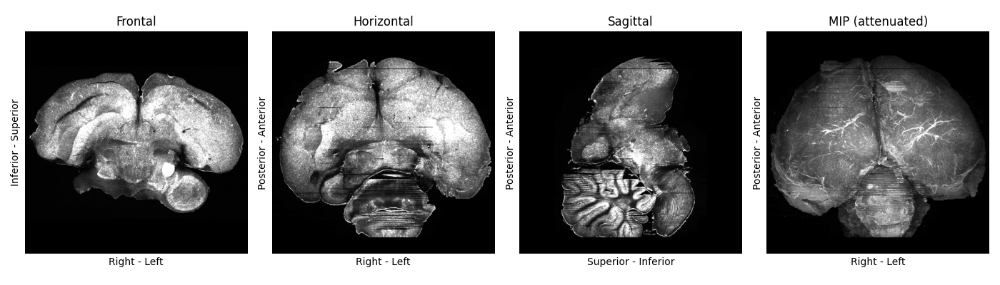
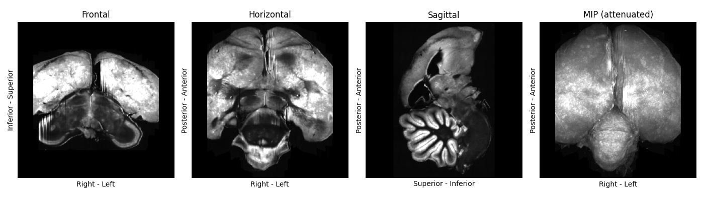
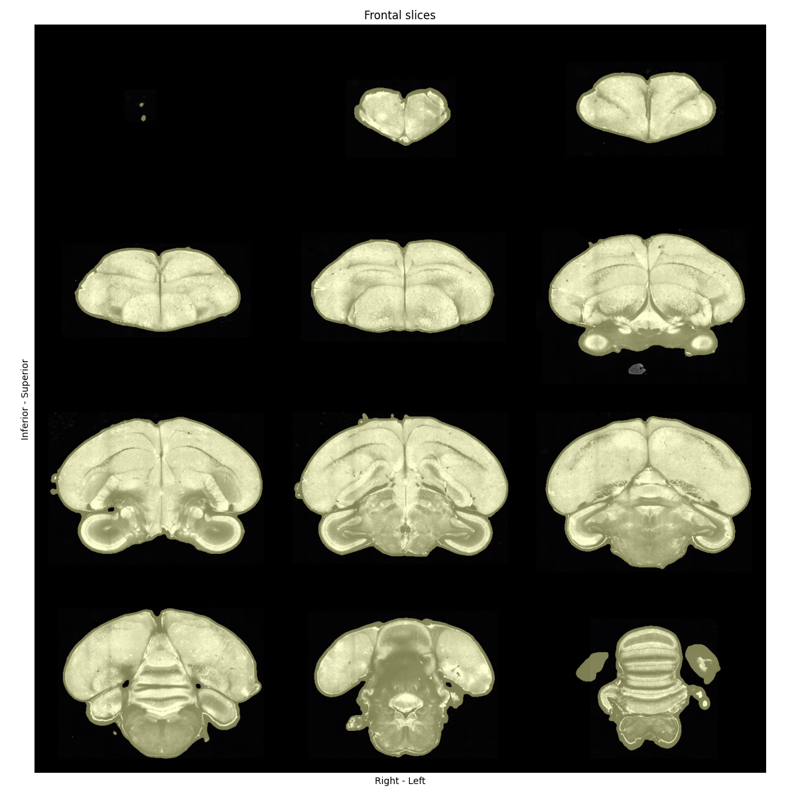

# How to prepare input images for template building

:::{caution}
This tutorial uses `brainglobe-template-builder` which is still in early development. This means features are missing and things may change a lot. We welcome your feedback on how this works for you - please get [in touch](/contact)!
:::

This guide shows how to prepare input images for building a symmetric anatomical template, and how to perform quality-control checks at each step.
We will use some serial-section two-photon microscopy images of whole zebra finch brains as an example.

:::{note}
After preparation, you will probably need access to a high-performance computing (HPC) platform to build a template. On the HPC, you will need to have ANTs and the optimizedANTs scripts installed and available on your path (these won't work on Windows systems!). See our [installation guide](https://github.com/brainglobe/brainglobe-template-builder/blob/main/README.md) for more details.

However, to follow this how-to guide, you will only need
* Your input images
* Familiarity with Python scripting
* Familiarity with setting up a `conda` environment or similar

Input images can be 
* A folder of 2D TIFFs, or 3D TIFF or NIfTI images that fit into your memory
* A folder of 2D TIFF images (can in total be larger than your available memory)
:::

## Installation	

If needed, create and activate a `conda` environment, then install `brainglobe-template-builder`:

```bash
conda create -n template-builder python=3.13 -y
conda activate template-builder
pip install brainglobe-template-builder
```

## Collate input image information in a file

Create an input CSV (comma-separated values) file (for example `zebrafinch.csv`) with at least these columns:

- `subject_id`
- `resolution_0`, `resolution_1`, `resolution_2` (in µm)
- `origin` (3-letter anatomical code)
- `filepath` (absolute path to input image)

You can optionally include a `mask_filepath` column, with paths to pre-computed or manually generated masks of each sample. Automatic generation of masks will be skipped for samples that have a non-empty `mask_filepath`.
You can also include a boolean column `use`, and set entries for samples you'd like to exclude to `False`.

You can have an arbitrary number of unique additional columns, to help you keep track of any metadata you may be interested in. These will be ignored by our code, but it can be useful for you to cross-check this information.
We provide a [minimal google sheet](https://docs.google.com/spreadsheets/d/14YnAdZsB7vp0Tyg5FbSBWlMCNIx9-iJLHWQzNgdMxWE/edit?usp=sharing) as a template for you to copy and edit.

For example, your CSV file may look like this:

```
| subject_id | resolution_0 | resolution_1 | resolution_2 | origin | filepath | mask_filepath | species | sex | use |
|---|---|---|---|---|---|---|---|---|
| ZF8001m | 25 | 25 | 25 | PSL | /data/zebrafinch/sourcedata/ZF8001m.tif | 											    | Zebra finch | M | True |
| ZF8002f | 25 | 25 | 25 | PSL | /data/zebrafinch/sourcedata/ZF8002f.tif | /data/zebrafinch/sourcedata/ZF8002f_mask.tif | Zebra finch | F | True |
```

Some quick checks before proceeding:

- Each `subject_id` is unique
- There are no spaces in the core CSV columns (You can have spaces in your own metadata).
- Every `filepath` exists and is readable
- `origin` values are [in the correct orientation](/documentation/setting-up/image-definition)

## Standardise orientation and resolution

Copy the below script, and adapt paths and `output_vox_size` for your purposes.
`source_csv` should point to the CSV file you created in the previous step.
In this example, we choose an output directory on mounted HPC storage, and downsample our data to 50um resolution.

:::{note}
If your input images are folders of 2D TIFFs that will not fit into your memory, choose `output_vox_size` sufficiently large so the downsampled array will fit.
We recommend `output_vox_size` to be at least 1/1000th of the longest brain axis: for example, if your brains are ~1 cm long, the highest resolution would be 10 um.
It may be worth running the pipeline on lower-resolution data first (in our example, e.g. 50 um or 100 um) to accelerate trouble-shooting.
:::

```
from pathlib import Path
from brainglobe_template_builder.standardise import standardise

input_csv = Path("/path/to/zebrafinch.csv")
output_dir = Path("/path/to/atlas-forge/ZebraFinch")

standardise(
	source_csv=input_csv,
	output_dir=output_dir,
	output_vox_size=50,
)
```
This will standardise the orientation and resolution of your inputs.
After running the script, you should have these expected outputs in your output directory:

- `standardised/standardised_images.csv`
- `standardised/sub-<subject_id>/...origin-asr.nii.gz` for each sample
- `standardised-QC/sub-<subject_id>-QC-orthographic.png` for each sample

## Inspect standardised plots

For quality-control, inspect the `.png` files in the `standardised-QC/` subfolder and confirm:
- Images are of sufficiently high quality. You could check that
  - The signal-to-noise ratio is high and consistent across the image
  - The brains are not severely cropped or damaged
- Orientation is [consistently "ASR"](/documentation/setting-up/image-definition) across samples (Figure 1)



**Figure 1: A standardised plot of high-quality zebrafinch brain image. No major damage or cropping visible, and its orientation matches the plot labels.**

If a sample is oriented or scaled wrongly:

- Fix its `origin` or `resolution_` entries in the input CSV
- Rerun the standardisation script.

If a sample image is not of sufficient quality
- Remove it from the input CSV file
- Delete the `standardised/` subfolder
- Rerun the standardisation script.

:::{note}
Gauging image quality is somewhat subjective and speculative. We provide examples of the zebra finch template building team's judgement calls in Figures 2+3, for reference. Mild sample warping and damage is usually fine, as long as it's distributed differentially across samples. 



**Figure 2: A standardised plot of a zebra finch brain image, displaying mild damage (missing parts of cerebellum, sample seems slightly deformed by preparation/imaging). We included this sample.**



**Figure 3: A standardised plot of a zebra finch brain image, displaying severe cropping on each side. We excluded this sample.**
:::

## Apply brightness correction and mask the samples

To normalise the brightness and create masks of each sample, copy the code below, adapt the path to the output directory. The `output_dir` variable should match the output directory passed in the previous script.

```
from pathlib import Path
from brainglobe_template_builder.preprocess import preprocess

output_dir = Path("/path/to/atlas-forge/ZebraFinch")
standardised_csv = output_dir / "standardised" / "standardised_images.csv"
preprocess(standardised_csv)
```
After running the script, check that you have the expected outputs:

- `preprocessed/all_processed_brain_paths.txt`
- `preprocessed/all_processed_mask_paths.txt`
- `preprocessed/sub-<subject_id>/..._processed.nii.gz` for each sample
- `preprocessed/sub-<subject_id>/..._processed_mask.nii.gz` for each sample
- `preprocessed-QC/sub-<subject_id>-mask-QC-grid.png` for each sample

Each `nii.gz` file should also have a left-right flipped (`..._lrflip.nii.gz`) equivalent. This will result in a symmetric template despite asymmetry in the inputs.

## Inspect quality-control plots for preprocessing

The `.png` files in `preprocessed-QC/` show a series of coronal sections of each of your samples, with their masks. You should check that
- mask should include full brain volume generously (with a small border around the brain - see Figure 4)
- mask should exclude obvious background/non-brain regions

If you need to improve a mask, open it with `napari` as [a `Labels` layer](https://napari.org/stable/howtos/layers/labels.html) to edit it, and overwrite the previous mask on disk. 
You should also update the `mask_filepath` in `standardised/standardised_images.csv` for the corrected sample.

:::{note}
If you have many unsatisfactory masks, you can try experimenting with different `MaskConfig` parameters using the "Preprocess" `napari` widget. Once you have found a set of parameters you are happy with, you can create `PreprocConfig` and `MaskConfig` objects to pass to your `preprocess` function.

The code above would then change to something like

```
from pathlib import Path
from brainglobe_template_builder.preprocess import preprocess
from brainglobe_template_builder.utils.preproc_config import PreprocConfig, MaskConfig, ThresholdMethod

output_dir = Path("/path/to/atlas-forge/ZebraFinch")
standardised_csv = output_dir / "standardised" / "standardised_images.csv"

# pad more generously, and use non-default masking parameters
config = PreprocConfig(
	output_dir=output_dir,
	mask=MaskConfig(   
		gaussian_sigma = 5, # default 3
    	threshold_method = "otsu", # default "triangle"
    	closing_size = 7, # default 5
    	erode_size = 2, # default 0
	)
	pad_pixels = 20
)
preprocess(standardised_csv, config=config)
```
:::



**Figure 4: Quality-control plot showing coronal sections of a zebra finch brain image, overlaid with nicely-fitting masks. A small border around the brain is expected, and no part of the brain should be missing from the mask.**

## (Optional) Set the initial target with the tilting widget

Choose one high-quality preprocessed brain as an initial target candidate. Save a copy of it separately to your input image.

Open `napari` and start the `brainglobe-template-builder` **Preprocess** widget. In the widget panel, use:

1. **Reorient to standard space** (if needed)
2. **Align midplane** to correct tilt/midline alignment
3. **Save files** to export the corrected target image

Save the selected sample image to a separate repository and make a note of its path.

## Move preprocessed inputs to the HPC storage

If your output directory was local, copy the entire preprocessed folder to your HPC storage.

Copy the text files from your `preprocessed/` folder to a new folder on the HPC storage. The new folder's name should reflect the template you are planning to build. In our example, this was `template_sym_female_res-50um_n-8` to denote that it was a symmetric template at 50 micrometer resolution, made from 8 female zebra finch brains.

Update the paths inside the text files to point to the processed input images on the HPC storage.

For example, we run the preprocessing steps on a local mount of the HPC storage to `/media`, so our text files look something like:
```
/media/ceph/neuroinformatics/neuroinformatics/atlas-forge/ZebraFinch/preprocessed/sub-ZF7927f/sub-ZF7927f_res-50x50x50um_origin-asr_processed.nii.gz
/media/ceph/neuroinformatics/neuroinformatics/atlas-forge/ZebraFinch/preprocessed/sub-ZF7927f/sub-ZF7927f_res-50x50x50um_origin-asr_processed_lrflip.nii.gz
/media/ceph/neuroinformatics/neuroinformatics/atlas-forge/ZebraFinch/preprocessed/sub-ZF0065f/sub-ZF0065f_res-50x50x50um_origin-asr_processed.nii.gz
/media/ceph/neuroinformatics/neuroinformatics/atlas-forge/ZebraFinch/preprocessed/sub-ZF0065f/sub-ZF0065f_res-50x50x50um_origin-asr_processed_lrflip.nii.gz
```

We then update it to
```
/ceph/neuroinformatics/neuroinformatics/atlas-forge/ZebraFinch/preprocessed/sub-ZF7927f/sub-ZF7927f_res-50x50x50um_origin-asr_processed.nii.gz
/ceph/neuroinformatics/neuroinformatics/atlas-forge/ZebraFinch/preprocessed/sub-ZF7927f/sub-ZF7927f_res-50x50x50um_origin-asr_processed_lrflip.nii.gz
/ceph/neuroinformatics/neuroinformatics/atlas-forge/ZebraFinch/preprocessed/sub-ZF0065f/sub-ZF0065f_res-50x50x50um_origin-asr_processed.nii.gz
/ceph/neuroinformatics/neuroinformatics/atlas-forge/ZebraFinch/preprocessed/sub-ZF0065f/sub-ZF0065f_res-50x50x50um_origin-asr_processed_lrflip.nii.gz
```

to reflect the absolute path of the images from the perspective of the HPC.

You are now ready to [configure and launch the template building script on your HPC](./howto-configure-hpc-template-building-job.md).
