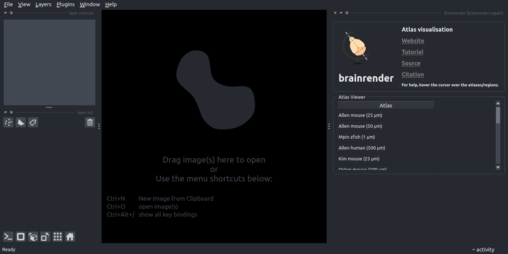
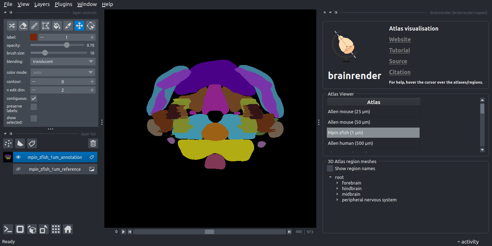

# Download an atlas in napari

In this tutorial, you will use `brainrender-napari`'s Atlas Manager widget to download a BrainGlobe atlas through a series of simple clicks. The [`mpin_zfish_1um` zebrafish brain atlas](https://doi.org/10.1016/j.neuron.2019.04.034) will serve as an example. 

:::{note}
You will need `napari` installed on your computer - please follow [`napari`'s installation instructions to do so](https://napari.org/stable/tutorials/fundamentals/installation.html).
:::

1. Open `napari`.
2. Install `brainrender-napari` by selecting `Plugins > Install/Uninstall plugins` and searching for `brainrender-napari` in the searchbox. Then click on the `Install` button.
3. Open the Atlas Manager widget by selecting `Plugins > Brainrender > Manage atlas versions` in the napari menu bar near the top left of the window. 

**The Atlas Manager widget appears on the right hand side of the window.**

4. In the widget's `Atlas table view` section, double-click the row which contains the `mpin_zfish_1um` atlas (you may have to scroll down slightly). Whe plugin will prompt you to download it (click yes). It may take a long time
(depending on your internet speed) so please be patient. We are working on providing a progress bar in `napari` - in the meantime, you can see download progress in the terminal from which you launched napari.

**You have downloaded the zebrafish atlas - you can visualise it in napari by following our atlas visualisation tutorial.**
