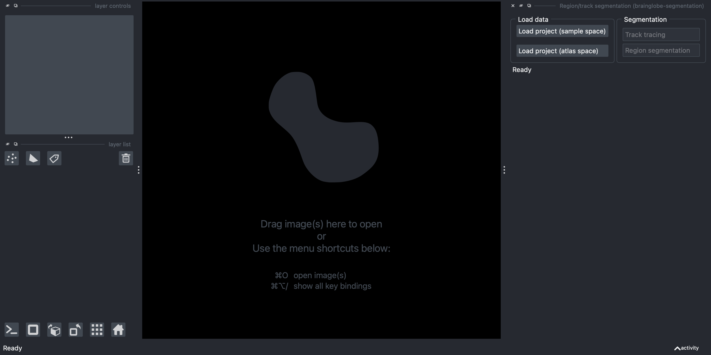
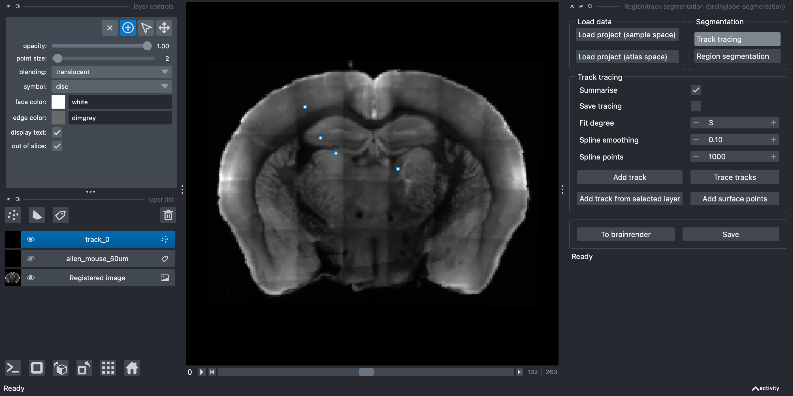
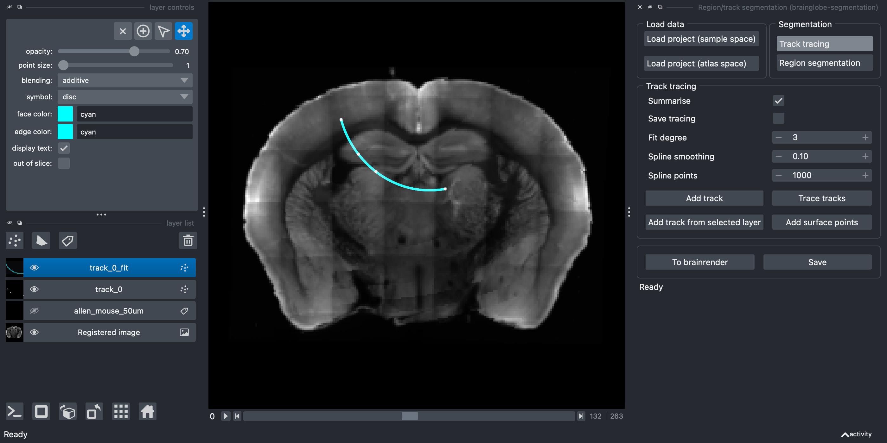

# Segmenting a 1D track

In this tutorial, you will use the [brainglobe-segmentation](../documentation/brainglobe-segmentation/index.md) plugin for [napari](https://napari.org) to segment a 1D track, such as a fibre track, or a silicon probe track. As a prerequisite, you will need to have registered your data to an atlas [using `brainreg`](../documentation/brainreg/index.md) and know what folder you saved this in (your "`brainreg` output directory"). If you don't have this, please follow [our registration tutorial](./tutorial-whole-brain-registration.md) first.

The focus of this tutorial is simply to successfully register a single, straight 1D track. For more information about how to process silicon probe tracks, please see [Silicon probe tracking](/tutorials/silicon-probe-tracking). 

:::{note}
You will need `napari` installed on your computer - please follow [`napari`'s installation instructions](https://napari.org/stable/tutorials/fundamentals/installation.html) to do so (including their recommendation to use a `conda` environment).
:::

1. Open `napari`.
2. Install `brainglobe-segmentation` by selecting `Plugins > Install/Uninstall plugins` and searching for `brainglobe-segmentation` in the searchbox. If it is not installed yet, click on the `Install` button.

:::{caution}
On Silicon Macs you may have to run `conda install hdf5` on the command line (in your conda environment) first for the installation to be successful.
:::

3. Open the `brainglobe-segmentation` widget by selecting `Plugins > Region/track segmentation (brainglobe-segmentation)` in the napari menu bar near the top left of the window.

**The brainglobe segmentation widget appears on the right-hand side of the window.**

4. Load your registered data in atlas space by clicking on `Load project (atlas space)` and navigating to your `brainreg` output directory.
5. If required, adjust the contrast on the registered image by selecting the `Registered Image` layer on the left of the screen, and clicking on `Autocontrast: once` on the top left of the screen.
6. Select the `Track tracing` button in the `Segmentation` panel.
7. Click the `Add track` button.

**A new Points layer named `track_0` appears on the left hand side.**

8. If required, rename the track (by selecting the `track_0` text).
9. Navigate in the image to where you want to draw your track.
10. Make sure the add points mode is activated (by selecting the `+` symbol on the top left - find out [more about how to add/delete/select points in napari](https://napari.org/stable/howtos/layers/points.html#adding-deleting-and-selecting-points)).
11. Trace your track by clicking along it. You can add as many, or as few, points as you like, and this can be done in 3D by changing the viewer plane as you go along.

**Points appear where you've clicked in the image**

:::{caution}
Make sure you select the points in the order you wish them to be joined.
:::

12. (Optional) If you want to add an additional first point exactly at the surface of the brain, click `Add surface points`. Selecting this option will add an additional point at the closest part of the brain surface (based on the registration) to the first point, so that the track starts there.
13. Join the points using spline interpolation by clicking `Trace tracks`. You can change:
  * `Summarise` - Defaults to on, this will save a csv file, showing the brain area for each part of the interpolated track (determined by `Spline points` )
  * `Save tracing` - Defaults to off. This will save your segmentation layer at the same time as running the analysis
  (this may make your analysis take longer)
  * `Fit degree` - What order spline fit to use (the default is 3, cubic)
  * `Spline smoothing` - How closely or not to fit the points (lower numbers fit more closely, for a less smooth interpolation)
  * `Spline points` - This doesn't affect the interpolation, but determines how many points are sampled from the interpolation (used for the summary)
  * `Add surface points` - Selecting this option will add an additional point at the closest part of the brain surface to the first point, so that the track starts there.

**A new Points layer containing the fitted points named `track_0_fit` appears on the left hand side and in the napari window, and a `.csv` file will be saved, showing the brain region for every spline point along the track along with the distance from the start of the track.**

:::{note}
All data will be saved into your brainreg output directory at `/segmentation/atlas_space/tracks` subfolder if you loaded the data from atlas space, otherwise, it will be in the `sample_space` subfolder.
:::

14. (Optional) Use the `Save` button to save your points as `.points` to be reloaded at a later date. Use the `To Brainrender` button to save the fitter spline as `.npy` for [brainrender](https://github.com/brainglobe/brainrender) visualisation.

:::{note}
Three files will be saved for each 1D track:
+ `TRACK_NAME.csv` - a csv file summarising the depth, atlas region name, and atlas region ID (based on your chosen atlas) for each point of the fitted spline.
+ `TRACK_NAME.npy` - a numpy array containing the coordinates for each point of the fitted spline. This array can be imported to [brainrender](/documentation/brainrender/index) for visualization.
+ `TRACK_NAME.points` - a [pandas HDF5 dataframe](https://pandas.pydata.org/docs/reference/api/pandas.DataFrame.to_hdf.html) containing the coordinates for each point used to create the track (e.g., from manual annotation).
:::

:::{hint}
For more information about how to use automated methods to segment your feature of interest, please see [Analysing segmentation from other napari plugins](../documentation/brainglobe-segmentation/user-guide/analysing-external-segmentation).
For full information on how to use brainglobe-segmentation, please see the [brainglobe-segmentation page](/documentation/brainglobe-segmentation/index)
:::
