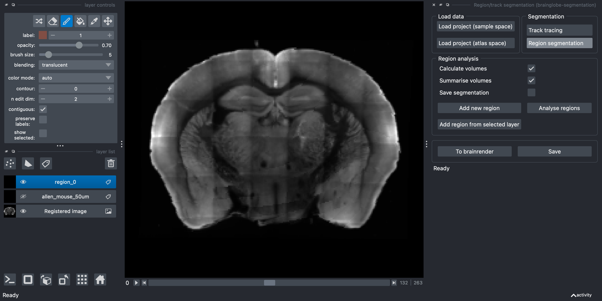

# Segmenting 2/3D structures

In this tutorial, you will use the [brainglobe-segmentation](../documentation/brainglobe-segmentation/index.md) plugin for [napari](https://napari.org) to segment a a 3D (or 2D) structure, such as an injection site. As a prerequisite, you will need to have registered your data to an atlas [using `brainreg`](../documentation/brainreg/index.md) and know what folder you saved this in (your "`brainreg` output directory"). If you don't have this, please follow [our registration tutorial](./tutorial-whole-brain-registration.md) first. 

:::{note}
You will need `napari` installed on your computer - please follow [`napari`'s installation instructions](https://napari.org/stable/tutorials/fundamentals/installation.html) to do so (including their recommendation to use a `conda` environment).
:::

1. Open `napari`.
2. Install `brainglobe-segmentation` by selecting `Plugins > Install/Uninstall plugins` and searching for `brainglobe-segmentation` in the searchbox. If it is not installed yet, click on the `Install` button.

:::{caution}
On Silicon Macs you may have to `conda install hdf5` first for the installation to be successful.
:::

3. Open the `brainglobe-segmentation` widget by selecting `Plugins > Region/track segmentation (brainglobe-segmentation)` in the napari menu bar near the top left of the window.

**The brainglobe segmentation widget appears on the right-hand side of the window.**

4. Load your registered data in atlas space by clicking on `Load project (atlas space)` and navigating to your `brainreg` output directory.
5. If required, adjust the contrast on the registered image by selecting the `Registered Image` layer on the left of the screen, and clicking on `Autocontrast: once` on the top left of the screen.
6. Click the `Region Segmentation` button in the 
`Segmentation` panel.
7. Click the `Add new region` button.

**A new Labels layer named `region_0` appears on the left hand side.**

8. If required, rename this region (by selecting the e.g. `region_0` text)
9. Navigate to where you want to draw your region of interest.
10. Choose a brush size (top left box).
11. Make sure painting mode is activated (by selecting the paintbrush icon, top left). You can go back to the navigation mode by selecting the magnifying glass.
12. Colour in your region that you want to segment by holding down the left mouse button, ensuring that you make a solid object. For 3D structures, set `n edit dim` to `3` to paint a sphere instead of a circle, or paint circles across several slices. You can change slice using the slider at the bottom of the screen.

13. Repeat steps 6.-11. for each other region you would like to segment.
14. Click `Analyse regions` to analyse the spatial distribution of the regions you have drawn.
    * If `Calculate volumes` is selected, the volume of each brain area included in the segmented region will be calculated and saved.
    * If `Summarise volumes` is selected, then each region will be summarised (centers, volumes etc)
    * If `Save segmentation` is selected, then the segmented layer will be saved at the same time as the analysis is run 
(this may make your analysis take longer)

15. (Optional) Use the `Save` button to save your segmented regions to be reloaded at a later date.

:::{note}
All data will be saved into your brainreg output directory
:::

:::{hint}
For more information about how to use automated methods to segment your feature of interest, please see [Analysing segmentation from other napari plugins](../documentation/brainglobe-segmentation/user-guide/analysing-external-segmentation).
For full information on how to use brainglobe-segmentation, please see the [brainglobe-segmentation page](/documentation/brainglobe-segmentation/index)
:::
