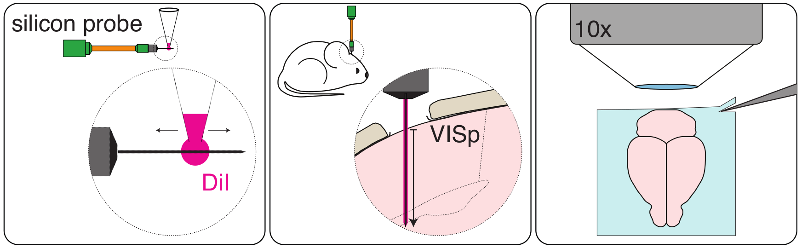

# Silicon probe tracking
Analysis of silicon probe tracks (e.g., Neuropixels) in brains imaged post-hoc
in a standard coordinate space

## Introduction

The aim of electrophysiological recordings using silicon probes is to record neuronal activity across brain regions 
and animals. It is therefore fundamental to record precisely the localisation of the probe (or multiple probes) in 
each brain and be able to compare probes across animals.

Here we describe a tool for the analysis of silicon probe tracks (e.g. [Neuropixels](https://www.neuropixels.org/)) 
in brains imaged post-hoc in a standard coordinate space. This tool is packaged with brainreg, as part of the 
BrainGlobe suite of computational neuroanatomy tools.

## Before tracing probe tracks

In order to label the probe penetration track in the brain, the probe is delicately coated with DiI 
(Molecular Probes, Cat# V22885) using a pipette tip (**Fig. 1**, left). The probe is then attached to a 
micromanipulator, and the probe tip lowered to touch the surface of the brain (e.g. in head-fixed mice). 
This position is recorded as position “zero”. The probe is then introduced in the brain at a speed of \~10μm 
per second to the desired penetration depth (in our case 1750μm; **Fig. 1**, centre).

**Figure 1.**

:::{note}
The final penetration depth has to be recorded precisely (e.g., with the micromanipulator readout) in order to know 
how much of the probe shank was used to record neuronal activity. This will allow comparing traced probe tracks and 
electrophysiological data.
:::

When the experiment is done and the probe is retracted, the animal is anaesthetised and perfused with PFA 4% following 
standard perfusion protocols. The brain is carefully extracted and left in PFA 4% overnight.

:::{note}
To ensure high quality image registration, it is essential that the brain is properly perfused in order to decrease 
the autofluorescence of blood vessels. It is also important that the brain is extracted from the skull carefully in 
order to avoid tissue damage.
:::

The brain is then thoroughly washed with 100mM PBS and imaged (e.g. by 
[Serial 2-Photon Tomography](https://sainsburywellcomecentre.github.io/OpenSerialSection/acquisition/); **Fig. 1**, 
right). We imaged 2 channels (one where DiI signal is detected and one with background fluorescence only) at a 
resolution of x = 5μm, y = 5μm, z = 20μm.

:::{note}
It is important to image both the DiI probe signal and the brain’s background fluorescence in two independent channels. 
The background signal will be used to register the brain into standard space (since the probe signal might interfere 
with the quality of registration).
:::

## Brain registration to an atlas

To track the probe in standard space, the brain must first be registered to an atlas using brainreg.

Before registration, brainreg needs to be installed, please follow the instructions 
[here](/documentation/brainreg/installation). Once installed, we can proceed to register the imaged brain.

:::{note}
Make sure you activate your conda environment before starting
:::

You will need:

1. The path where the brain image stack (DiI signal channel) is located
2. The path where the brain stack (background fluorescence channel) is located.&#x20;
3. The path where you want the registration result to be saved
4. The resolution at which the brain was imaged

**To register your brain to an atlas, please follow the instructions for brainreg 
[here](/documentation/brainreg/user-guide/brainreg-napari)**.

A new output directory has been created, which contains the registered brain. We are now ready to manually 
trace the probe track.

## Probe track tracing

:::{caution}
Make sure your conda environment is still activated!
:::

To open the graphical user interface, open napari and then load the `brainglobe-segmentation` plugin (see 
[User guide](/documentation/brainglobe-segmentation/user-guide/index)).

The `brainglobe-segmentation`graphical user interface opens and shows a set of tools.You can then load your brainreg output 
directory, and follow the main brainglobe-segmentation instructions [here](/documentation/brainglobe-segmentation/user-guide/segmenting-1d-tracks) for 
segmenting a 1D track. Setting `Spline points` will determine how many times along the length of the track that 
the brain region is sampled at. This can be used to determine the brain region for each recording site on your probe.

**Adapted from instructions by** [**Mateo Vélez-Fort**](https://www.sainsburywellcome.org/web/people/mateo-velez-fort)
