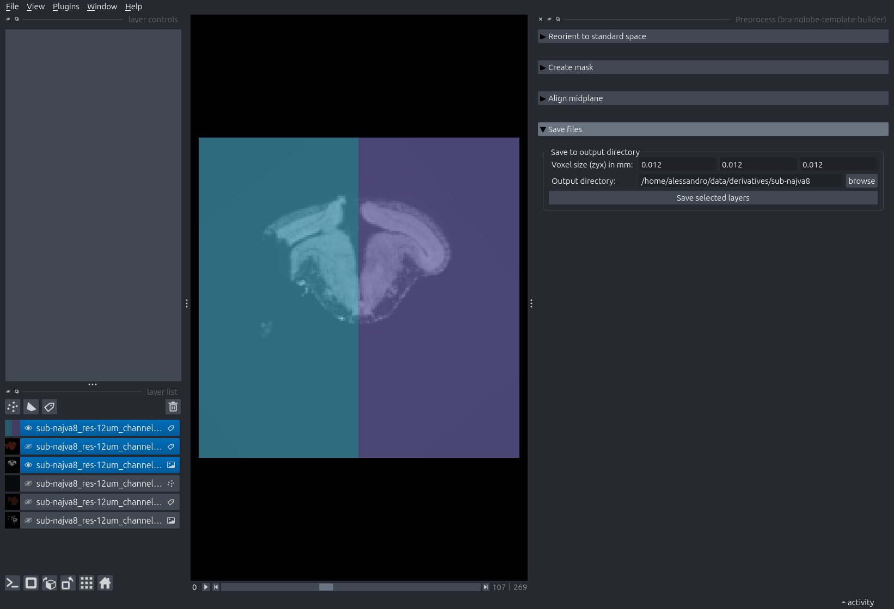

# Aligning samples for template building

:::{caution}
This tutorial uses `brainglobe-template-builder` which is still in early development. This means features are missing and things may change a lot. Use at your own risk!
:::

Brain templates are an average of many brain images. To compute this average, it is highly beneficial to roughly pre-align individual brain images. This makes the averaging a lot faster and more reliable.

The `brainglobe-template-builder` tool provides a Graphical User Interface to pre-align sample images to be used for template building later. It's an early work-in-progress tool, so you will have to install it from 
Githubm via the command `pip install git+https://github.com/brainglobe/brainglobe-template-builder`. We recommend doing this in a separate conda environment.

This manual work needs to be done only once per sample, on a low-resolution image. We recommend downsampling samples for template building to images < 100MB initially for preprocessing and initial template building. The results can be automatically reused later to create higher-resolution atlases. 

1. Open `napari`.
2. Open the `Preprocess` widget by selecting `Plugins > Preprocess (brainglobe-template-builder)` in the menu bar near the top left of the window. 

**The Preprocess widget appears on the right hand side of the window, listing four steps**

3. Open the lowest resolution version of your sample - either drag and drop it onto the `napari` canvas, or do `File > Open`. We use a tadpole brain downsampled to 12um isotropic resolution here - and we take note that the orientation of this sample is PLS [in BrainGlobe convention](/documentation/brainglobe-space/index).

**The tadpole brain is opened in napari.**

4. Set the source origin to the orientation of your sample, in BrainGlobe convention (PLS for our example tadpole). Double-check the target origin is ASR. Then press the "Reorient selected layers" button.
 

**The tadpole brain is now re-oriented. Note that the orientation may not perfect (it isn't in the example case) because this step only includes reorientation in steps of 90 degrees, and the sample is tilted with respect to its anatomical axes.**

5. Expand the next step: "Create Mask", and click the "Create Mask" button. Explore the mask in 3D by toggling the 2D/3D icon (little square/cube) on the lower left.

 **The mask is a Labels layer that should distinguish brain from non-brain as best possible. Prefer having background in the brain rather than brain in the background. You can play with the parameters in this step to improve the mask. Delete and recreate the mask layer to do so.**

6. Manually remove any regions that should not be included in the brain from the mask. You can do this by selecting the mask layer from the layer list (it will be highlighted in blue) and then using the eraser and paint brush icons from the layer controls in the top left. 

:::{note}
The `n edit dim` parameter allows you to switch between editing the mask in 2 and 3 dimensions.
:::

**In our case, we have manually removed the tadpole's spinal cord from the mask.**

7. Switch back to a 2D view and expand the next step: "Align midplane". Click "Estimate points".

**A new Points layer appears in the layer list, containing 9 points arranged in a 3x3 grid across planes in the sample.**

8. Move the points so they lie along the sagittal midplane of your sample. You can do so by selecting the points layer (click on it, and it will be highlighted in blue) and using the layer controls on the top left.

**An example of two points moved to the tadpoles sagittal midplane.**

9. Click "Align image".

**Napari will add three new layers: the aligned sample, the aligned mask, and a labels layer dividing the aligned brain into two hemispheres.**

10. If you are happy with the result, click "Save transform" so you can reproduce this in the future. If you would like to improve, delete the three aligned images and repeat steps 7-9.

11. Expand the next step: "Save files"

12. Input the voxel size of the sample in millimeters, and browse to the output folder. It is a good idea to name this folder after the sample: in our case the sample is called `najva8`, so we name the output folder `sub-najva8`.

13. Select the three topmost layers in the layerlist by `Shift+Left Mouse` clicking on the first and the third. Click "Save selected layers".

**Napari just before saving the three aligned layers.**

:::{note}
Double-check that this has worked by navigating to the output folder - it should contain 6 new image files: 3 `.nii.gz` and 3 `.tif`. The names of these files will start with the original sample name and end with one of `asr_aligned`, `asr_label-brain_aligned` or `asr_label-halves_aligned`.

:::
