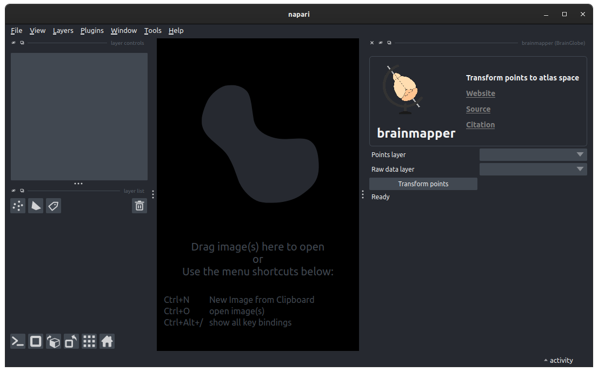

# Analysing brainwide distribution of cells

In this tutorial you will use the [`brainmapper` napari widget](/documentation/brainglobe-utils/transform-widget) 
to analyse the position of some points in an atlas. 

The aim of this tutorial is to illustrate how to use the widget on a small dataset. After completing this tutorial, 
you could try using the widget with the outputs of the 
[whole brain cell detection tutorial](/tutorials/brainmapper/index), or even analysing the data from start to finish 
using [`cellfinder`](/documentation/cellfinder/index), [`brainreg`](/documentation/brainreg/index) and then this 
`brainmapper` widget.

:::{note}
You will need napari installed on your machine, and also to have previously run `brainreg`. Before following the next
steps, please ensure you have followed the
[registering a whole-brain image to an atlas tutorial](/tutorials/tutorial-whole-brain-registration).
:::

1. Open `napari`.
2. Install `brainglobe-utils` by selecting `Plugins > Install/Uninstall plugins` and searching for `brainglobe-utils` in the searchbox. Then click on the `Install` button.
3. Open the `brainmapper` widget by selecting `Plugins > brainmapper (BrainGlobe)` in the napari menu bar near the top left of the window.
   

**The brainmapper widget appears on the right-hand side of the window.**

4. Open the same sample image from the [whole brain cell detection tutorial](/tutorials/brainmapper/index) by 
selecting `File > Open Sample > Low resolution brain (brainreg)`.
5. Make the image easier to see by adjusting the `contrast limits` in the top left section of the napari window. Moving
   the right-hand slider to the left will make the image appear brighter.
6. Create a new points layer by clicking the `New points layer" button (on the left, just above the list of napari layers).
7. Select the `Add points` button from the top left of the napari window (you can also press `2` or `p` on your 
keyboard to activate this mode).
8. Create a few (10-20) points by clicking on various parts of the brain image. You can navigate in 3D 
by using the slider at the bottom of the napari window.

:::{hint}
In this tutorial we are creating some points manually. In real usage, these could be any point feature in your image, 
detected manually or automatically (e.g. [with cellfinder](/tutorials/cellfinder-detection))
:::

9. In the `brainmapper` widget, select your new points layer (named `Points` by default) from the dropdown next to `Points layer`. 
10. Select your image layer (named `Sample brain` by default) from the dropdown next to `Raw data layer`.
11. Click `Transform points` and when prompted, select the brainreg output directory saved during the [whole brain cell detection tutorial](/tutorials/brainmapper/index).
12. A new table will then appear in the widget, listing the number of cells in each atlas region, for each hemisphere. 
Two new points layers will also be created.

**The distribution of points is displayed in the widget, and two new layers are generated.**

13. Click on `Save points summary`, choose a directory, and call the file `points_summary.csv`. This will save a file
containing a more detailed version of the table.
14. Click on `Save all points information`, choose a directory, and call the file `all_points.csv`. This will save a file
    containing the coordinates (in image and atlas space) and atlas region for every point for use in other analyses.
15. Select the `Points in atlas space` layer. This is the same as the `Points` layer, but each point has been moved to 
its position within the atlas (in voxel space). This can be saved to disk using any compatible plugin.

 :::{hint}
Saving points layers with an `.xml` file extension will save the points layer to the BrainGlobe format, and these can 
be loaded into other BrainGlobe tools. 
 :::