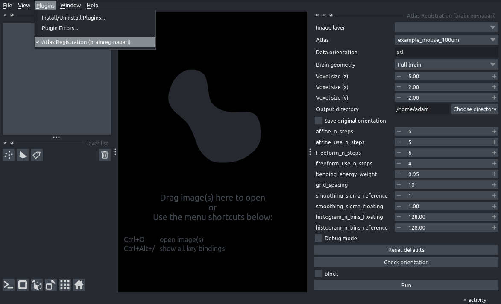
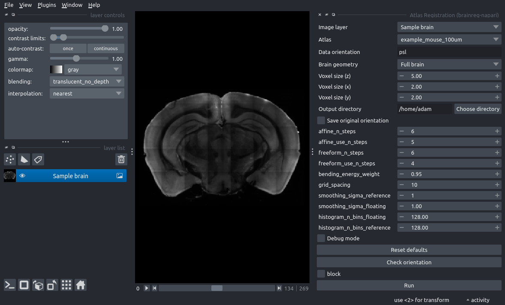
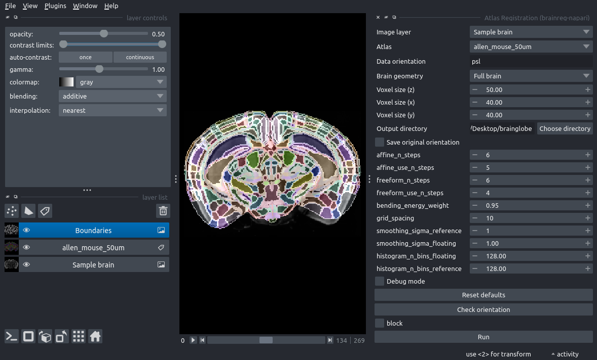

# Registering a whole-brain image to an atlas

In this tutorial, you will use the [brainreg](/documentation/brainreg) plugin for [napari](https://napari.org) to 
register (align) a whole-mouse brain image to a reference atlas.

The focus of this tutorial is simply to successfully register a single image.
Optimising brainreg for specific applications will be covered separately. 

:::{note}
You will need `napari` installed on your computer - please follow [`napari`'s installation instructions to do so](https://napari.org/stable/tutorials/fundamentals/installation.html).
:::

1. Open `napari`.
2. Install `brainreg-napari` by selecting `Plugins > Install/Uninstall plugins` and searching for `brainreg-napari` in the searchbox. Then click on the `Install` button.
3. Open the `brainreg` widget by selecting `Plugins > Atlas registration (brainreg-napari)` in the napari menu bar near the top left of the window.


**The brainreg widget appears on the right-hand side of the window.**

4. Open the sample image by selecting `File > Open Sample > Low resolution brain (brainreg-napari)`. 
5. Make the image easier to see by adjusting the `contrast limits` in the top left section of the napari window. Moving
the right-hand slider to the left will make the image appear brighter. 


**A whole mouse brain image loaded into napari.**


6. In the plugin widget, set all the necessary parameters:

* `Image layer` - Set this to the `Sample brain` image layer
* `Atlas` - Set this to `allen_mouse_50um`
* `Data orientation` - Set this to `psl`
* `Voxel size (z)` - Set to 50
* `Voxel size (x)` - Set to 40
* `Voxel size (y)` - Set to 40
* `Output directory` - Click `Choose directory`, and create a new directory on your machine

7. Click `Run`. After 30-60 seconds, two new napari layers will be loaded, `Boundaries` and `allen_mouse_50um`.
8. Toggle the visibility of these two layers (using the eye icon on the left of the layer name) to overlay the 
registration results. These can be explored by zooming in/out, scrolling through the 3D data and adjusting the 
visibility and contrast of the loaded data. 



**Registration results overlaid onto raw data.**

9. At this point, registration is complete. A number of 
[files are created in the output directory](documentation/brainreg/user-guide/output-files) that can be used for 
downstream analysis.

:::{note}
The results are likely not perfect because (for speed and simplicity) we:

* Used very low-resolution data
* Use a low-resolution atlas
* Left all the parameters as default (which were optimised for higher resolution atlases)
:::


```{hint}
For full information on how to use brainreg, please see the [brainreg page](/documentation/brainreg/index)
```