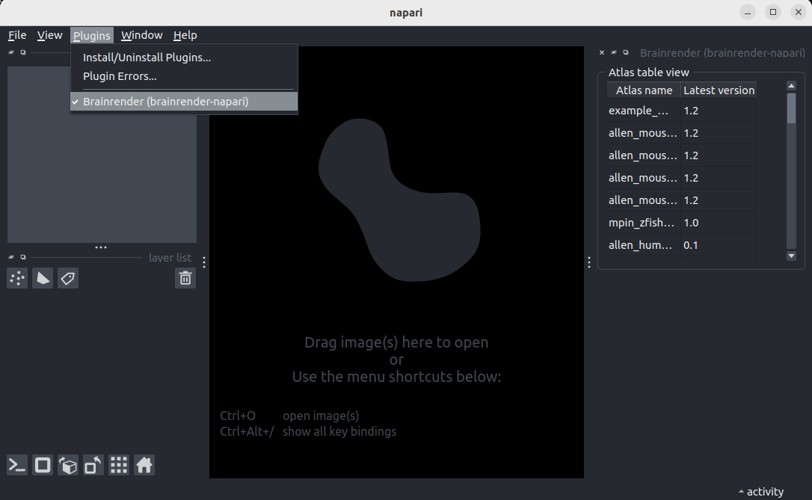
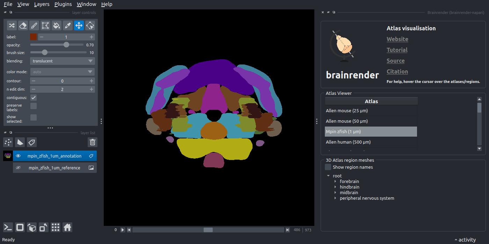
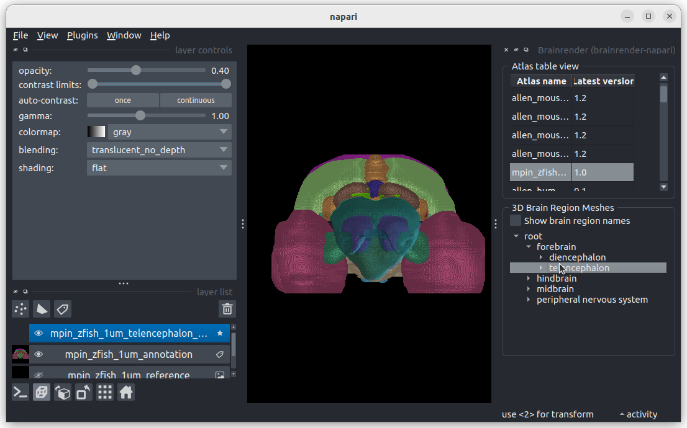
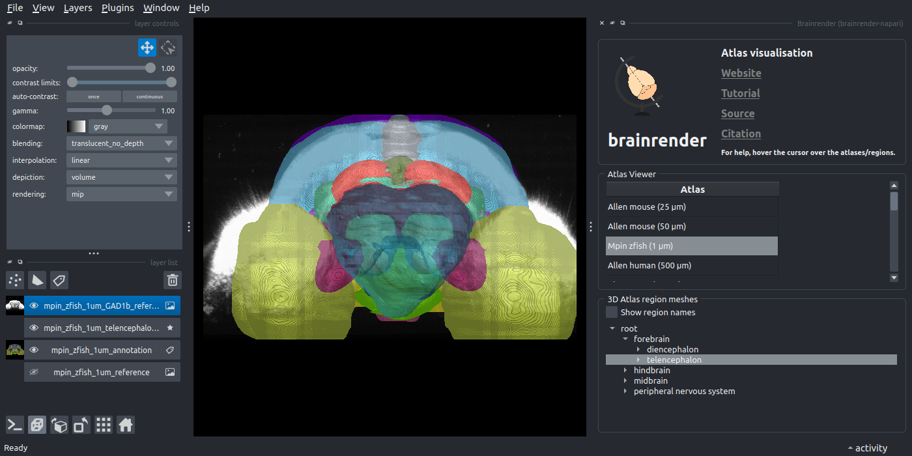

## Visualise an atlas in napari

BrainGlobe atlases are made of different components. These include the annotations image, the (default) reference image, 3D brain region meshes and, optionally, additional reference images. In this tutorial, you will use `brainrender-napari` to visualise each of these components in the 3D viewer napari through a series of simple clicks. The [`mpin_zfish_1um` zebrafish brain atlas](https://doi.org/10.1016/j.neuron.2019.04.034) will serve as an example. 

:::{note}
You will need `napari` installed on your computer - please follow [`napari`'s installation instructions to do so](https://napari.org/stable/tutorials/fundamentals/installation.html).
:::

1. Open `napari`.
2. Install `brainrender-napari` by selecting `Plugins > Install/Uninstall plugins` and searching for `brainrender-napari` in the searchbox. Then click on the `Install` button.
3. Open the `brainrender` widget by selecting `Plugins > Brainrender (brainrender-napari)` in the napari menu bar near the top left of the window. 

**The brainrender widget appears on the right hand side of the window.**

4. In the `brainrender` widget's `Atlas table view` section, double-click the row which contains the `mpin_zfish_1um` atlas.

**You have now added the annotations image and the default reference image to napari: They appear as layers in the napari layers list on the lower left of the window. A `3D Brain region meshes` section appears below the `Atlas table view` section.**

:::{note}
If you haven't downloaded the atlas before, the plugin will prompt you to download it (click yes). It may take a long time
(depending on your internet speed) so please be patient. Once downloaded, double click again to view the atlas.
:::

5. Toggle the napari display from 2D to 3D by pressing the button with the square icon on the lower left of the window.

**The annotations image should now be displayed in 3D.**
6. Navigate the brain region tree in the `3D Brain region meshes` section by opening "forebrain". Double-click on `telencephalon`.

 **You have now added a 3D brain region mesh layer, which appears as a mesh in the viewer and as a new layer in the layers list.**
7. Back in the "Atlas table view" section, right-click on the `mpin_zfish_1um` row. In the menu that appears, select `GAD1b`.

**You have now added an additional reference image, which appears as a grey scale image in the viewer and as a new layer in the layers list.**

You have now added all possible kinds of BrainGlobe atlas components (annotations image, reference image, 3D brain region mesh, additional reference) to napari - well done! You can now add any of the other atlases listed in the `Atlas table view` if you like (note that not all atlases have additional references!). 

:::{note}
Hover over any of the elements in the `brainrender` widget to get additional hints about how to use them!
:::